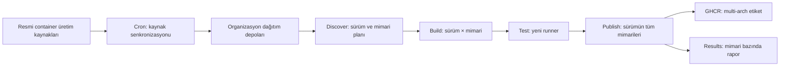

# Low-Price-Hosting · Container

**Linux temel imajları için kaynaklardan build, mimari bazında test ve GHCR yayını.**

[](https://github.com/Low-Price-Hosting/Container/actions/workflows/build-base-images.yml)
[](https://github.com/Low-Price-Hosting/Cron/actions/workflows/mirror-container-sources.yml)
[](https://github.com/orgs/Low-Price-Hosting/packages?ecosystem=container)

**8 dağıtım** · **Dinamik sürüm ve mimari keşfi** · **Build → Test → Publish** · **OCI metadata**

[İmajlar ve indirmeler](#imajlar-ve-indirmeler) · [Mimariler](#sürüm-ve-mimari-referansları) · [Kullanım](#hızlı-kullanım) · [Build başlatma](#build-başlatma) · [Akış](#build-akışı) · [Metadata](#oci-label-ve-annotation-referansı)

---

## Proje ne yapar?

Bu depo, organizasyonun Linux dağıtımı depolarındaki container üretim reçetelerini kullanarak temel imajlar üretir. Her dağıtımın build kodu kendi klasöründedir; tek workflow keşif, build, test ve yayını yönetir.

| Bileşen | Görev |
|---|---|
| [Cron](https://github.com/Low-Price-Hosting/Cron) | Resmi upstream container üretim kaynaklarını ve sürüm bilgilerini organizasyon depolarına senkronize eder. |
| [Dağıtım depoları](https://github.com/orgs/Low-Price-Hosting/repositories) | Container üretimi için gerekli reçeteleri, kodları ve kaynak referanslarını barındırır. |
| **Container** | Kaynakları belirli bir commit'e sabitler, rootfs/imaj üretir, çalıştırarak test eder ve GHCR'ye yayımlar. |
| [GitHub Container Registry](https://github.com/orgs/Low-Price-Hosting/packages?ecosystem=container) | Sürüm etiketlerini, mimarileri, digest'leri ve indirme istatistiklerini sunar. |

Build sırasında kullanılan resmi bootstrap imajı, derleme araçlarının çalışacağı ortamı sağlar. Son imajın rootfs'i dağıtımın üretim reçetesiyle oluşturulur. Paketler, bu reçetelerin tanımladığı dağıtım paket depolarından alınır.

<details>
<summary>Dağıtıma göre üretim yöntemi ve sürüm keşfi</summary>

| Dağıtım | Container üretimi | Yeni sürümün bulunması |
|---|---|---|
| [Ubuntu](ubuntu/) | `livecd-rootfs`, `PROJECT=ubuntu-oci`, `live-build`; rootfs → `FROM scratch`. | Cron, resmi `meta-release` içindeki `Supported: 1` kayıtlarını alır. |
| [Debian](debian/) | `debuerreotype/examples/debian.sh` ve `debootstrap`; rootfs → `FROM scratch`. | Cron, yayımlanmış ve destek süresi bitmemiş Debian sürümlerini seçer. |
| [CentOS Stream](centos/) | Container kickstart'ın paket seçimi ve `%post` adımları; `dnf --installroot`; rootfs → `FROM scratch`. | `CentOS-Stream-*-container-base.ks` dosyaları taranır. |
| [Alpine](alpine/) | `aports` minirootfs/genrootfs betikleri; minirootfs → `FROM scratch`. | Cron, resmi sürüm kataloğundaki desteği süren, `edge` olmayan dalları seçer. |
| [Fedora](fedora/) | KIWI, `Fedora.kiwi`, `Container-Base-Generic` OCI profili; Buildah VFS. | Cron, resmi sürüm verisindeki en büyük sayısal sürüm ve bir önceki sürümü seçer. |
| [AlmaLinux](almalinux/) | Upstream `Containerfile.default` installroot ve final `scratch` aşamaları. | `Containerfiles/<sürüm>/Containerfile.default` dizinleri taranır. |
| [Arch Linux](archlinux/) | `archlinux-docker` üretim betikleri, `base` profili. | `rolling` hedefi; `latest` ve `base` alias'ları. |
| [Rocky Linux](rockylinux/) | Kaynak yapısına göre KIWI `container-build.sh` veya container kickstart paketleri ve `%post` adımları. | Organizasyon kaynak deposundaki `rN` dalları taranır. |

Kickstart adaptörleri container için paket ve rootfs yapılandırmasını uygular; disk kurulumu, bootloader ve installer işlemleri çalıştırılmaz. Sürüm keşif kuralları dağıtıma göre farklı olduğundan tüm dağıtımlar için tek bir EOL politikası varsayılmamalıdır.

</details>

## Canlı build durumu

| İzlenecek bilgi | Bağlantı |
|---|---|
| Build, test ve publish işleri | [Container Actions](https://github.com/Low-Price-Hosting/Container/actions/workflows/build-base-images.yml) |
| Kaynak senkronizasyonu | [Cron Actions](https://github.com/Low-Price-Hosting/Cron/actions/workflows/mirror-container-sources.yml) |
| Yayımlanmış etiketler, OS/Arch ve indirmeler | [Organizasyon Packages](https://github.com/orgs/Low-Price-Hosting/packages?ecosystem=container) |
| Mimari bazında sonuçlar | İlgili çalışmanın **Results** job'ı ve `results-summary` artifact'i |
| O çalışmanın kesin hedefleri | İlgili çalışmanın `build-plan` artifact'i |

Üstteki build rozeti, `main` dalındaki son workflow sonucunu gösterir. `verify_only=true` ile yapılan bir çalışma başarılı build/test gösterebilir; bu modda imaj yayımlanmaz. Bir imajın yayımlandığını doğrulamak için ilgili **Publish** sonucuna ve paket etiketine bakın.

## İmajlar ve indirmeler

İmaj adları doğrudan `ghcr.io/low-price-hosting/<dağıtım>` biçimindedir. GHCR paketleri organizasyonda saklanır; kaynak ilişkisi ilgili dağıtım deposuna, build ilişkisi bu depoya işaret eder.

| Dağıtım / kaynak | İmaj referansı | Paket, etiketler ve OS/Arch | Toplam indirme |
|---|---|---|---|
| [Ubuntu](https://github.com/Low-Price-Hosting/Ubuntu) | `ghcr.io/low-price-hosting/ubuntu` | [Packages](https://github.com/orgs/Low-Price-Hosting/packages/container/package/ubuntu) | [](https://github.com/orgs/Low-Price-Hosting/packages/container/package/ubuntu) |
| [Debian](https://github.com/Low-Price-Hosting/Debian) | `ghcr.io/low-price-hosting/debian` | [Packages](https://github.com/orgs/Low-Price-Hosting/packages/container/package/debian) | [](https://github.com/orgs/Low-Price-Hosting/packages/container/package/debian) |
| [CentOS Stream](https://github.com/Low-Price-Hosting/Centos) | `ghcr.io/low-price-hosting/centos` | [Packages](https://github.com/orgs/Low-Price-Hosting/packages/container/package/centos) | [](https://github.com/orgs/Low-Price-Hosting/packages/container/package/centos) |
| [Alpine](https://github.com/Low-Price-Hosting/Alpine) | `ghcr.io/low-price-hosting/alpine` | [Packages](https://github.com/orgs/Low-Price-Hosting/packages/container/package/alpine) | [](https://github.com/orgs/Low-Price-Hosting/packages/container/package/alpine) |
| [Fedora](https://github.com/Low-Price-Hosting/Fedora) | `ghcr.io/low-price-hosting/fedora` | [Packages](https://github.com/orgs/Low-Price-Hosting/packages/container/package/fedora) | [](https://github.com/orgs/Low-Price-Hosting/packages/container/package/fedora) |
| [AlmaLinux](https://github.com/Low-Price-Hosting/AlmaLinux) | `ghcr.io/low-price-hosting/almalinux` | [Packages](https://github.com/orgs/Low-Price-Hosting/packages/container/package/almalinux) | [](https://github.com/orgs/Low-Price-Hosting/packages/container/package/almalinux) |
| [Arch Linux](https://github.com/Low-Price-Hosting/ArchLinux) | `ghcr.io/low-price-hosting/archlinux` | [Packages](https://github.com/orgs/Low-Price-Hosting/packages/container/package/archlinux) | [](https://github.com/orgs/Low-Price-Hosting/packages/container/package/archlinux) |
| [Rocky Linux](https://github.com/Low-Price-Hosting/RockyLinux) | `ghcr.io/low-price-hosting/rockylinux` | [Packages](https://github.com/orgs/Low-Price-Hosting/packages/container/package/rockylinux) | [](https://github.com/orgs/Low-Price-Hosting/packages/container/package/rockylinux) |

İndirme rozetleri GitHub paket sayfasındaki **Total downloads** değerini okur; bir etikete veya mimariye özel sayaç değildir. Sürümün kendi indirme sayısı paket sayfasında görüntülenir. Rozet ve GitHub görüntü önbelleği nedeniyle sayılar anlık değişmeyebilir.

<details>
<summary>İndirme rozetlerinin veri kaynağı</summary>

[Shields.io Dynamic Regex](https://shields.io/badges/dynamic-regex-badge), herkese açık GitHub paket sayfasındaki toplam sayacı okur. Bu özellik deneysel olduğu için GitHub HTML yapısı değişirse rozet güncellenmeyebilir.

`resource not found` veya `inaccessible`, sayacın okunamadığını belirtir; **0 indirme anlamına gelmez**. Paket henüz yayımlanmamış, herkese açık erişime kapalı veya servis geçici olarak erişilemez olabilir. Doğrudan **Packages** bağlantısını kullanın.

</details>

## Sürüm ve mimari referansları

Aşağıdaki tablo, [8 Ekim 2026 tarihli keşif planındaki](https://github.com/Low-Price-Hosting/Container/actions/runs/37741062225) hedeflerin referansıdır. Yeni sürümler ve mimariler sonraki keşiflerde değişebilir. Tablo keşfedilen platformları gösterir; yayımlanmış imaj garantisi değildir. Kesin yayımlanmış mimari seti, seçtiğiniz **etiketin OCI index'inde** bulunur.

| Dağıtım | Keşfedilen sürümler | Platformlar — `linux/` önekiyle |
|---|---|---|
| Ubuntu | `22.04`, `24.04`, `26.04` | `amd64`, `arm/v7`, `arm64`, `ppc64le`, `riscv64`, `s390x` |
| Debian | `bookworm` | `386`, `amd64`, `arm/v7`, `arm64`, `ppc64le` |
| Debian | `trixie` | `386`, `amd64`, `arm/v5`, `arm/v7`, `arm64`, `ppc64le`, `riscv64`, `s390x` |
| CentOS Stream | `stream9`, `stream10` | `amd64`, `arm64`, `ppc64le`, `s390x` |
| Alpine | `3.21`, `3.22`, `3.23`, `3.24` | `386`, `amd64`, `arm/v6`, `arm/v7`, `arm64`, `ppc64le`, `riscv64`, `s390x` |
| Fedora | `43`, `44` | `amd64`, `arm64`, `ppc64le`, `s390x` |
| AlmaLinux | `8`, `9` | `386`, `amd64`, `arm64`, `ppc64le`, `s390x` |
| AlmaLinux | `10` | `386`, `amd64`, `amd64/v2`, `arm64`, `ppc64le`, `s390x` |
| Arch Linux | `rolling` | `amd64` |
| Rocky Linux | `8` | `amd64`, `arm64` |
| Rocky Linux | `9` | `amd64`, `arm64`, `ppc64le`, `s390x` |
| Rocky Linux | `10` | `amd64`, `arm64`, `ppc64le`, `riscv64`*, `s390x` |

Mimariler sürüme göre farklıdır. Birden fazla sürüm aynı satırdaysa bu keşif planında aynı platform setine sahiptir; gelecekteki keşiflerde bu set değişebilir.

\* Bu keşif planında Rocky Linux 10 `riscv64` hedefi bulundu, fakat paket metadata kontrolü başarısız oldu; hedef build matrix'ine alınmadı.

### Bir etiketin gerçek mimarilerini inceleme

Aşağıdaki örneklerde `24.04` yerine kullanmak istediğiniz yayımlanmış etiketi yazın:

```bash
docker buildx imagetools inspect ghcr.io/low-price-hosting/ubuntu:24.04
```

Ham OCI index ve mimari/variant referansları:

```bash
docker buildx imagetools inspect --raw ghcr.io/low-price-hosting/ubuntu:24.04
```

`amd64` hedefleri Ubuntu x86 runner'da, `arm64` hedefleri yerel ARM runner'da çalışır. Diğer işlemci aileleri gerektiğinde QEMU ile çalıştırılır; `386` x86 runner üzerinde çalışır. Emülasyon süreleri yerel buildlerden uzun olabilir.

## Hızlı kullanım

Önce **Packages** bölümünden yayımlanmış etiketi seçin. Aşağıdaki komutlarda `24.04` örnek bir Ubuntu sürüm etiketidir.

### İndir ve çalıştır

```bash
docker pull ghcr.io/low-price-hosting/ubuntu:24.04

docker run --rm -it ghcr.io/low-price-hosting/ubuntu:24.04 /bin/sh
```

Herkese açık paketleri indirmek için GHCR oturumu gerekmez. Docker, multi-arch etiketten bilgisayarınızla eşleşen mimariyi seçer.

### Belirli mimariyi seç

```bash
docker pull --platform linux/arm64 ghcr.io/low-price-hosting/ubuntu:24.04

docker run --rm --platform linux/arm64 \
  ghcr.io/low-price-hosting/ubuntu:24.04 \
  /bin/sh -c 'cat /etc/os-release'
```

Farklı işlemci ailesindeki bir imajı çalıştırmak için hostta uygun emülasyon gerekir; yalnızca imajı indirmek emülasyon gerektirmez.

### Sürümü digest ile sabitle

```bash
docker image inspect --format '{{json .RepoDigests}}' \
  ghcr.io/low-price-hosting/ubuntu:24.04

# <digest> yerine paket/index sayfasındaki 64 karakterlik SHA256 değerini yazın.
docker pull ghcr.io/low-price-hosting/ubuntu@sha256:<digest>
```

Sürüm etiketleri yeni buildlerle güncellenebilir. Aynı imajı tekrar kullanmak için digest ile sabitleyin.

### Kendi imajında temel olarak kullan

```dockerfile
FROM ghcr.io/low-price-hosting/ubuntu:24.04

COPY app/ /opt/app/
WORKDIR /opt/app
CMD ["/bin/sh"]
```

## Build başlatma

### GitHub arayüzünden

[Build base images](https://github.com/Low-Price-Hosting/Container/actions/workflows/build-base-images.yml) → **Run workflow**:

| Alan | Değer / anlam |
|---|---|
| `distribution` | `all` veya sekiz dağıtımdan birinin workflow'daki adı |
| `version` | `all` veya keşif kataloğundaki tam sürüm: ör. `24.04`, `trixie`, `stream10`, `rolling` |
| `verify_only` | `true`: seçilen hedefleri yeniden build edip test eder; GHCR'ye yazmaz. `false`: değişiklikleri build/test edip yayımlar. |

Tek bir dağıtım seçseniz de o sürümün keşfedilen **tüm mimarileri** işlenir.

### GitHub CLI ile

Yetkili bir GitHub CLI oturumundan:

```bash
# Tüm dağıtımlar: değişen veya eksik imajları build/test edip yayımla.
gh workflow run build-base-images.yml \
  --repo Low-Price-Hosting/Container --ref main \
  -f distribution=all -f version=all -f verify_only=false

# Fedora'nın tüm keşfedilen sürüm ve mimarilerini yalnızca doğrula.
gh workflow run build-base-images.yml \
  --repo Low-Price-Hosting/Container --ref main \
  -f distribution=Fedora -f version=all -f verify_only=true

# Son çalışmaları listele.
gh run list --repo Low-Price-Hosting/Container \
  --workflow build-base-images.yml
```

Yayın işlemleri organizasyon Actions secret'ı `GH_TOKEN_CLASSIC` kullanır. Secret, `Container` deposuna açık olmalı; token sahibinin ilgili paketlere yazma yetkisi ve classic token'ın uygun `write:packages` yetkisi bulunmalıdır. Ayrıntılar: [GitHub Container Registry kimlik doğrulaması](https://docs.github.com/en/packages/working-with-a-github-packages-registry/working-with-the-container-registry#authenticating-to-the-container-registry).

## Build akışı



| Aşama | Yapılan işlem | Görünen sonuç |
|---|---|---|
| **Discover** | Organizasyon kaynaklarını, sürümleri, resmi bootstrap manifestindeki platformları ve paket metadata'sını inceler. | Dinamik build/release matrix ve `build-plan.json`. |
| **Build** | Keşfedilen kaynak commit'iyle dağıtımın reçetesini çalıştırır. Her hedef ayrı runner kullanır. | `built-<hedef>` imaj arşivi, checksum ve build sonucu. |
| **Test** | Arşivin checksum'unu doğrular; imajı ayrı runner'a yükleyip çalıştırır. | Test onayı, gerçek işletim sistemi sürümü ve test sonucu. |
| **Publish** | Bir sürümün tüm beklenen mimarileri testten geçtiyse doğrulanmış arşivleri yükler ve OCI index'i yayımlar. | Sürüm etiketi, alias'lar, digest ve push sonucu. |
| **Results** | Build/test/push/cache sonuçlarını mimariye göre toplar. | Çalışmanın Summary alanı ve indirilebilir Markdown rapor. |

Buildler aynı runner üzerinde peş peşe birikmez. Her sürüm/mimari buildi ve testi kendi job'ında çalışır. Build matrix'inden test matrix'ine geçiş, build aşamasının tamamlanmasından sonra gerçekleşir.

Bir sürümün mimarilerinden biri build/test aşamasında başarısızsa o sürümün etiketi eksik mimari setiyle güncellenmez. Diğer sürümler kendi sonuçlarına göre yayımlanabilir.

### Test kapsamı

Testler imajı gerçekten çalıştırır ve şunları kontrol eder:

- `/etc/os-release` içindeki dağıtım kimliği.
- Dağıtımın paket yöneticisinin bulunması: APT, APK, Pacman veya DNF ailesi.
- Gerçek `VERSION_ID` değeri ve yerel imaj referanslarının sürüm tutarlılığı.
- Docker imaj mimarisinin beklenen işlemci ailesiyle eşleşmesi.
- `org.opencontainers.image.source` label'ının organizasyondaki doğru kaynak deposunu göstermesi.

Bunlar temel çalışma kontrolleridir. Paket yöneticisinin internete erişimini, bütün paketleri veya uygulama uyumluluğunu kapsamlı olarak test etmez.

### Değişiklik algılama ve cache

Yeniden build kararı; üretim reçeteleri, Container build/test kodu, bootstrap digest'i ve resmi paket indexlerinin checksum'larından hesaplanan fingerprint'e dayanır.

GHCR'de aynı fingerprint'e sahip, test onayı bulunan geçerli bir mimari manifesti varsa yeniden kullanılır. Yeni veya değişmiş hedefler build edilir. `verify_only=true` seçimi yeniden kullanım yerine seçilen hedefleri yeniden build/test eder.

Paket indirme cache'i yalnızca paket dosyalarını saklar; paket indexleri yeniden kontrol edilir. Her hedefin kaydedilen paket cache'i **64 MiB** ile sınırlandırılır. Job arşivleri ile paket cache'i farklı amaçlar için kullanılır.

### Otomatik güncellemeler

Saatlik zamanlama [Cron workflow'unda](https://github.com/Low-Price-Hosting/Cron/blob/main/.github/workflows/mirror-container-sources.yml) `0 * * * *` olarak tanımlıdır. Cron, senkronizasyon sonrasında bu depoya `source-mirrors-updated` olayı gönderir. GitHub zamanlanmış çalışmaları geciktirebilir; tam `:00` başlangıcı garanti edilmez.

Bu depoda sürüm başına sabit workflow job'ları bulunmaz. Mevcut dağıtımların yeni sürüm/mimari hedefleri, kaynak kataloğu ve reçeteler güncellendiğinde keşfedilir. Yeni hedefin build edilebilmesi için kaynak dalı, resmi bootstrap manifesti ve gerekli paket depoları erişilebilir olmalıdır. Yeni bir **dağıtım** eklemek ise ayrıca bir build adaptörü gerektirir.

## Etiket ve yayın mantığı

| Referans | Amaç |
|---|---|
| `ubuntu:24.04`, `debian:trixie`, `centos:stream10` | Bir sürümün test edilmiş tüm mimarilerini içeren etiket. |
| Kaynak kataloğunun tanımladığı alias'lar | Kod adı, sürüm alias'ı veya `latest` gibi aynı OCI index'e yönelen etiketler. |
| Gerçek `VERSION_ID` etiketi | Tüm mimariler aynı geçerli sürüm değerini bildirdiğinde eklenir. |
| `<dağıtım>@sha256:<digest>` | Değişmez içerik referansı; tekrar kullanılacak imajı sabitler. |

Etiketler katalogdan ve test sonuçlarından türetilir. Her dağıtımın alias seti aynı değildir. GHCR yayını sırasında mimari manifestleri digest ile yüklenir; kullanıcıya sunulan sürüm etiketleri multi-arch index'e bağlanır.

Build sırasında kullanılan fingerprint içeren yerel etiketler, son kullanıcı için ayrı GHCR sürüm etiketleri olarak yayımlanmaz.

## OCI label ve annotation referansı

Metadata, imajın hangi kaynak ve build koduyla üretildiğini takip etmeyi sağlar.

| Anahtar | Nerede | Anlam |
|---|---|---|
| `org.opencontainers.image.source` | İmaj label'ı + release index | Organizasyondaki ilgili dağıtım kaynak deposu. |
| `org.opencontainers.image.title` | İmaj label'ı + release index | Dağıtım ve sürüm. |
| `org.opencontainers.image.description` | İmaj label'ı + release index | İmaj açıklaması; index'te mimari listesi de bulunur. |
| `org.opencontainers.image.version` | İmaj label'ı + release index | Keşfedilen sürüm etiketi. |
| `org.opencontainers.image.revision` | İmaj label'ı | Upstream kaynak revision'ı. |
| `org.opencontainers.image.vendor` | İmaj label'ı + release index | `Low-Price-Hosting`. |
| `io.low-price-hosting.source.commit` | İmaj label'ı | Organizasyon kaynak deposunun kullanılan commit'i. |
| `io.low-price-hosting.build.source` | İmaj label'ı + release index | Bu build deposu: `Low-Price-Hosting/Container`. |
| `io.low-price-hosting.build.revision` | Actions build imajının label'ı | Container deposunun build commit'i. |
| `io.low-price-hosting.platform` | İmaj label'ı | Hedef OCI platformu. |
| `io.low-price-hosting.build.inputs` | Mimari manifestinin index descriptor annotation'ı | Yeniden build kararında kullanılan fingerprint. |
| `io.low-price-hosting.tested` | Mimari manifestinin index descriptor annotation'ı | Mimari imajının test onayı. |
| `io.low-price-hosting.os.version` | Mimari descriptor; sürümler aynıysa release index | Testte okunan gerçek işletim sistemi sürümü. |

İmaj label'larını görmek için:

```bash
docker image inspect --format '{{json .Config.Labels}}' \
  ghcr.io/low-price-hosting/ubuntu:24.04
```

Index ve descriptor annotation'larını görmek için `docker buildx imagetools inspect --raw` kullanın. Annotation'lar ile imaj config label'ları farklı alanlardır.

## Depo düzeni

```text
.github/workflows/build-base-images.yml   Tek build/test/publish workflow'u
build-base.sh                            Bir sürüm/mimari hedefini üretir
ubuntu/                                  Ubuntu üretim kodu
debian/                                  Debian üretim kodu
centos/                                  CentOS Stream üretim kodu
alpine/                                  Alpine üretim kodu
fedora/                                  Fedora üretim kodu
almalinux/                               AlmaLinux üretim kodu
archlinux/                               Arch Linux üretim kodu
rockylinux/                              Rocky Linux üretim kodu
scripts/                                 Ortak keşif, test, yayın ve rapor kodu
```

<details>
<summary>Önemli dosyalar</summary>

| Dosya | Görev |
|---|---|
| [Workflow](.github/workflows/build-base-images.yml) | Tek çalışma içindeki job'lar ve dinamik matrix'ler. |
| [discover-builds.py](scripts/discover-builds.py) | Kaynak, sürüm, mimari keşfi ve yeniden build kararı. |
| [repository-metadata.py](scripts/repository-metadata.py) | Paket indexlerinden değişiklik fingerprint'i. |
| [build-base.sh](build-base.sh) | Sabitlenmiş organizasyon kaynaklarından tek hedefin üretimi. |
| [build-common.sh](scripts/build-common.sh) | Builder ortamı, rootfs ve OCI yükleme yardımcıları. |
| [test-images.sh](scripts/test-images.sh) | Yerel imajın çalışma ve metadata kontrolleri. |
| [image-artifact.sh](scripts/image-artifact.sh) | Build arşivini kaydetme, checksum ile doğrulama ve yükleme. |
| [push-images.sh](scripts/push-images.sh) | Test edilen arşivi GHCR'ye digest ile yükleme. |
| [publish-release.py](scripts/publish-release.py) | Tam sürümün test onaylarını doğrulama ve yayın yönetimi. |
| [publish-manifests.py](scripts/publish-manifests.py) | OCI index, mimari descriptor'ları ve sürüm alias'ları. |
| [summarize-builds.py](scripts/summarize-builds.py) | Mimari bazında Build/Test/Push/Cache raporu. |

Dağıtıma özel değişiklik için ilgili klasördeki `build.sh`, `build-rootfs.sh` ve `repositories.json` dosyalarını inceleyin. Ortak workflow'a sürüm job'ı eklemek gerekmez.

</details>

## Sorun giderme

| Durum | Bakılacak yer |
|---|---|
| Sürüm keşfedilemiyor | Cron sonucu, ilgili kaynak deposunun sürüm kataloğu/dalları ve Discover log'u. |
| `no matching manifest` | Seçilen etikette istediğiniz platformun bulunup bulunmadığı. |
| Paket metadata kontrolü başarısız | Discover log'undaki ilgili hedef hatası ve resmi paket indexi erişimi. |
| Build uzun sürüyor | İlgili mimarinin Build log'u; emülasyon ve son ilerleyen komut. Fedora Buildah adımları başlangıç/bitiş/süre bilgisi verir ve süre sınırı kullanır. |
| Test başarısız | İlgili Test job'ı; dağıtım kimliği, paket yöneticisi, architecture ve source label. |
| `permission_denied: write_package` | `GH_TOKEN_CLASSIC` erişimi, token'ın paket yazma yetkisi ve paket sahibinin izinleri. |
| Etiket güncellenmedi | Aynı sürümün tüm mimarilerinin test onayları ve Publish sonucu. |
| İndirme rozeti veri göstermiyor | Herkese açık paket sayfası ve GitHub/Shields erişimi. |

### Referanslar

- [GitHub workflow durum rozetleri](https://docs.github.com/en/actions/how-tos/monitor-workflows/add-a-status-badge)
- [GitHub Container Registry: kullanım, paket ilişkisi ve kimlik doğrulaması](https://docs.github.com/en/packages/working-with-a-github-packages-registry/working-with-the-container-registry)
- [Shields.io Dynamic Regex indirme rozetleri](https://shields.io/badges/dynamic-regex-badge)
