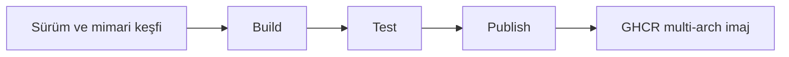

<div align="center">

**🌐 Languages / Diller**

**Türkçe** · [English](docs/i18n/README.en.md) · [简体中文](docs/i18n/README.zh-CN.md) · [繁體中文](docs/i18n/README.zh-TW.md) · [日本語](docs/i18n/README.ja.md) · [한국어](docs/i18n/README.ko.md)

[Deutsch](docs/i18n/README.de.md) · [Français](docs/i18n/README.fr.md) · [Español](docs/i18n/README.es.md) · [Português (Brasil)](docs/i18n/README.pt-BR.md) · [Italiano](docs/i18n/README.it.md) · [Русский](docs/i18n/README.ru.md)

[Українська](docs/i18n/README.uk.md) · [العربية](docs/i18n/README.ar.md) · [فارسی](docs/i18n/README.fa.md) · [हिन्दी](docs/i18n/README.hi.md) · [Bahasa Indonesia](docs/i18n/README.id.md) · [Tiếng Việt](docs/i18n/README.vi.md)

</div>

---

# Low-Price-Hosting · Container

**Linux temel container imajları — kaynak reçetelerinden build, mimari bazında test ve GHCR yayını.**

[](https://github.com/Low-Price-Hosting/Container/actions/workflows/build-base-images.yml)
[](https://github.com/Low-Price-Hosting/Cron/actions/workflows/mirror-container-sources.yml)
[](https://github.com/orgs/Low-Price-Hosting/packages?ecosystem=container)

**8 dağıtım** · **Dinamik sürüm ve mimariler** · **Build → Test → Publish**

[İmajlar](#images-and-downloads) · [Mimariler](#versions-and-architectures) · [Kullanım](#quick-start) · [Build başlatma](#run-builds) · [Build akışı](#pipeline) · [İmaj bilgileri](#oci-metadata)

---

<a id="images-and-downloads"></a>

## İmajlar ve indirmeler

| Dağıtım | İmaj referansı | Etiketler ve OS/Arch | Toplam indirme |
|---|---|---|---|
| [Ubuntu](https://github.com/Low-Price-Hosting/Ubuntu) | `ghcr.io/low-price-hosting/ubuntu` | [Packages](https://github.com/orgs/Low-Price-Hosting/packages/container/package/ubuntu) | [](https://github.com/orgs/Low-Price-Hosting/packages/container/package/ubuntu) |
| [Debian](https://github.com/Low-Price-Hosting/Debian) | `ghcr.io/low-price-hosting/debian` | [Packages](https://github.com/orgs/Low-Price-Hosting/packages/container/package/debian) | [](https://github.com/orgs/Low-Price-Hosting/packages/container/package/debian) |
| [CentOS Stream](https://github.com/Low-Price-Hosting/Centos) | `ghcr.io/low-price-hosting/centos` | [Packages](https://github.com/orgs/Low-Price-Hosting/packages/container/package/centos) | [](https://github.com/orgs/Low-Price-Hosting/packages/container/package/centos) |
| [Alpine](https://github.com/Low-Price-Hosting/Alpine) | `ghcr.io/low-price-hosting/alpine` | [Packages](https://github.com/orgs/Low-Price-Hosting/packages/container/package/alpine) | [](https://github.com/orgs/Low-Price-Hosting/packages/container/package/alpine) |
| [Fedora](https://github.com/Low-Price-Hosting/Fedora) | `ghcr.io/low-price-hosting/fedora` | [Packages](https://github.com/orgs/Low-Price-Hosting/packages/container/package/fedora) | [](https://github.com/orgs/Low-Price-Hosting/packages/container/package/fedora) |
| [AlmaLinux](https://github.com/Low-Price-Hosting/AlmaLinux) | `ghcr.io/low-price-hosting/almalinux` | [Packages](https://github.com/orgs/Low-Price-Hosting/packages/container/package/almalinux) | [](https://github.com/orgs/Low-Price-Hosting/packages/container/package/almalinux) |
| [Arch Linux](https://github.com/Low-Price-Hosting/ArchLinux) | `ghcr.io/low-price-hosting/archlinux` | [Packages](https://github.com/orgs/Low-Price-Hosting/packages/container/package/archlinux) | [](https://github.com/orgs/Low-Price-Hosting/packages/container/package/archlinux) |
| [Rocky Linux](https://github.com/Low-Price-Hosting/RockyLinux) | `ghcr.io/low-price-hosting/rockylinux` | [Packages](https://github.com/orgs/Low-Price-Hosting/packages/container/package/rockylinux) | [](https://github.com/orgs/Low-Price-Hosting/packages/container/package/rockylinux) |

İndirme rozetleri GitHub Packages'taki **Total downloads** değerini gösterir. Sürüm bazında indirmeler ve yayımlanmış mimariler ilgili paket sayfasındadır. Önbellek nedeniyle sayaçlar gecikebilir; okunamayan sayaç **0** anlamına gelmez.

<a id="versions-and-architectures"></a>

## Sürüm ve mimari referansları

[8 Ekim 2026 keşif planından](https://github.com/Low-Price-Hosting/Container/actions/runs/37741062225) sürüm/mimari referansları. Bunlar keşfedilen hedeflerdir; yayımlanmış mimarileri seçtiğiniz etiketin **OS/Arch** alanından veya OCI index'inden kontrol edin.

| Dağıtım | Sürümler | Platformlar — `linux/` önekiyle |
|---|---|---|
| Ubuntu | `22.04`, `24.04`, `26.04` | `amd64`, `arm/v7`, `arm64`, `ppc64le`, `riscv64`, `s390x` |
| Debian | `bookworm` | `386`, `amd64`, `arm/v7`, `arm64`, `ppc64le` |
| Debian | `trixie` | `386`, `amd64`, `arm/v5`, `arm/v7`, `arm64`, `ppc64le`, `riscv64`, `s390x` |
| CentOS Stream | `stream9`, `stream10` | `amd64`, `arm64`, `ppc64le`, `s390x` |
| Alpine | `3.21`, `3.22`, `3.23`, `3.24` | `386`, `amd64`, `arm/v6`, `arm/v7`, `arm64`, `ppc64le`, `riscv64`, `s390x` |
| Fedora | `43`, `44` | `amd64`, `arm64`, `ppc64le`, `s390x` |
| AlmaLinux | `8`, `9` | `386`, `amd64`, `arm64`, `ppc64le`, `s390x` |
| AlmaLinux | `10` | `386`, `amd64`, `amd64/v2`, `arm64`, `ppc64le`, `s390x` |
| Arch Linux | `rolling` | `amd64` |
| Rocky Linux | `8` | `amd64`, `arm64` |
| Rocky Linux | `9` | `amd64`, `arm64`, `ppc64le`, `s390x` |
| Rocky Linux | `10` | `amd64`, `arm64`, `ppc64le`, `riscv64`*, `s390x` |

\* Rocky Linux 10 `riscv64` hedefi bu planda build dışında kaldı. Mimari setleri sürüme göre değişebilir.

Bir etiketin gerçek mimarilerini inceleyin:

```bash
docker buildx imagetools inspect ghcr.io/low-price-hosting/ubuntu:24.04
docker buildx imagetools inspect --raw ghcr.io/low-price-hosting/ubuntu:24.04
```

<a id="quick-start"></a>

## Hızlı kullanım

Örneklerdeki `24.04` yerine kullanmak istediğiniz **yayımlanmış etiketi** seçin. Herkese açık imajları indirmek için GHCR oturumu gerekmez.

### İndir ve çalıştır

```bash
docker pull ghcr.io/low-price-hosting/ubuntu:24.04
docker run --rm -it ghcr.io/low-price-hosting/ubuntu:24.04 /bin/sh
```

Docker, multi-arch etiketten bilgisayarınızın mimarisine uygun imajı seçer.

### Mimari seç

```bash
docker pull --platform linux/arm64 ghcr.io/low-price-hosting/ubuntu:24.04

docker run --rm --platform linux/arm64 \
  ghcr.io/low-price-hosting/ubuntu:24.04 \
  /bin/sh -c 'cat /etc/os-release'
```

Farklı işlemci ailesindeki bir imajı çalıştırmak için uygun emülasyon gerekir.

### Digest ile sabitle

```bash
docker image inspect --format '{{json .RepoDigests}}' \
  ghcr.io/low-price-hosting/ubuntu:24.04

# <digest> yerine imajın SHA256 değerini yazın.
docker pull ghcr.io/low-price-hosting/ubuntu@sha256:<digest>
```

Sürüm etiketleri güncellenebilir; digest aynı imajı tekrar kullanmanızı sağlar.

### Kendi imajında kullan

```dockerfile
FROM ghcr.io/low-price-hosting/ubuntu:24.04

COPY app/ /opt/app/
WORKDIR /opt/app
CMD ["/bin/sh"]
```

<a id="run-builds"></a>

## Build başlatma

[Actions → Build base images → Run workflow](https://github.com/Low-Price-Hosting/Container/actions/workflows/build-base-images.yml):

| Alan | Kullanım |
|---|---|
| `distribution` | `all` veya bir dağıtım adı. |
| `version` | `all` veya tam sürüm: `24.04`, `trixie`, `stream10`, `rolling` gibi. |
| `verify_only` | `true`: yeniden build/test, yayın yok. `false`: değişen veya eksik imajları build/test edip yayımla. |

Seçilen sürümün keşfedilen tüm mimarileri işlenir. GitHub CLI ile:

```bash
# Tüm dağıtımlarda değişen veya eksik imajları üret ve yayımla.
gh workflow run build-base-images.yml \
  --repo Low-Price-Hosting/Container --ref main \
  -f distribution=all -f version=all -f verify_only=false

# Fedora imajlarını yalnızca build edip test et.
gh workflow run build-base-images.yml \
  --repo Low-Price-Hosting/Container --ref main \
  -f distribution=Fedora -f version=all -f verify_only=true
```

Üstteki build rozeti son workflow sonucunu gösterir; yalnızca doğrulama yapılan bir çalışma imaj yayımlamaz.

<a id="pipeline"></a>

## Build akışı



| Aşama | İmaj için yapılan işlem |
|---|---|
| **Build** | Dağıtımın container üretim reçetesiyle rootfs/imaj oluşturulur. |
| **Test** | İmaj ayrı runner'da çalıştırılır; dağıtım kimliği, paket yöneticisi, mimari ve kaynak label'ı kontrol edilir. |
| **Publish** | Bir sürümün tüm beklenen mimarileri testten geçtiğinde multi-arch sürüm etiketi yayımlanır. |

Her build/test hedefi ayrı runner kullanır. Testler temel çalışma kontrolleridir; kapsamlı uygulama uyumluluğu testi değildir.

Yeni sürüm ve mimariler kaynak kataloglarından otomatik keşfedilir. İlgili reçete, kaynak dalı, bootstrap manifesti ve paket depoları hazır olduğunda build planına alınır. Kaynaklar saatlik Cron akışıyla güncellenir; GitHub zamanlaması gecikebilir.

<a id="oci-metadata"></a>

## Etiketler ve imaj bilgileri

| Referans | Anlam |
|---|---|
| `ubuntu:24.04`, `debian:trixie`, `centos:stream10` | İlgili sürümün test edilmiş mimarilerini içeren multi-arch etiket. |
| `latest` ve diğer alias'lar | Dağıtımın sürüm kataloğuna göre belirlenen etiketler. |
| `<image>@sha256:<digest>` | Değişmez imaj içeriği referansı. |

İmajın kaynak, sürüm ve üretim bilgileri OCI metadata'sında bulunur:

```bash
docker image inspect --format '{{json .Config.Labels}}' \
  ghcr.io/low-price-hosting/ubuntu:24.04
```

`org.opencontainers.image.source` kaynak reçete deposunu, `org.opencontainers.image.version` sürümü ve `io.low-price-hosting.build.source` üretim kodunu gösterir. Multi-arch index ve mimari annotation'ları `docker buildx imagetools inspect --raw` ile okunabilir.
