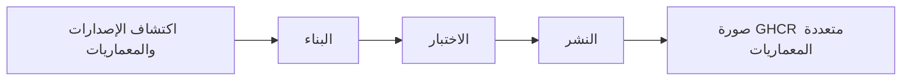

<div align="center">

**🌐 اللغات**

[Türkçe](../../README.md) · [English](README.en.md) · [简体中文](README.zh-CN.md) · [繁體中文](README.zh-TW.md) · [日本語](README.ja.md) · [한국어](README.ko.md)

[Deutsch](README.de.md) · [Français](README.fr.md) · [Español](README.es.md) · [Português (Brasil)](README.pt-BR.md) · [Italiano](README.it.md) · [Русский](README.ru.md)

[Українська](README.uk.md) · **العربية** · [فارسی](README.fa.md) · [हिन्दी](README.hi.md) · [Bahasa Indonesia](README.id.md) · [Tiếng Việt](README.vi.md)

</div>

---

# Low-Price-Hosting · Container

**صور حاويات Linux الأساسية — بناء من وصفات المصدر، واختبار لكل معمارية، ونشر على GHCR.**

[](https://github.com/Low-Price-Hosting/Container/actions/workflows/build-base-images.yml)
[](https://github.com/Low-Price-Hosting/Cron/actions/workflows/mirror-container-sources.yml)
[](https://github.com/orgs/Low-Price-Hosting/packages?ecosystem=container)

**8 توزيعات** · **إصدارات ومعماريات ديناميكية** · **بناء → اختبار → نشر**

[الصور](#images-and-downloads) · [المعماريات](#versions-and-architectures) · [الاستخدام](#quick-start) · [بدء البناء](#run-builds) · [مسار البناء](#pipeline) · [معلومات الصور](#oci-metadata)

---

<a id="images-and-downloads"></a>

## الصور والتنزيلات

| التوزيعة | مرجع الصورة | الوسوم وOS/Arch | إجمالي التنزيلات |
|---|---|---|---|
| [Ubuntu](https://github.com/Low-Price-Hosting/Ubuntu) | `ghcr.io/low-price-hosting/ubuntu` | [الحزم](https://github.com/orgs/Low-Price-Hosting/packages/container/package/ubuntu) | [](https://github.com/orgs/Low-Price-Hosting/packages/container/package/ubuntu) |
| [Debian](https://github.com/Low-Price-Hosting/Debian) | `ghcr.io/low-price-hosting/debian` | [الحزم](https://github.com/orgs/Low-Price-Hosting/packages/container/package/debian) | [](https://github.com/orgs/Low-Price-Hosting/packages/container/package/debian) |
| [CentOS Stream](https://github.com/Low-Price-Hosting/Centos) | `ghcr.io/low-price-hosting/centos` | [الحزم](https://github.com/orgs/Low-Price-Hosting/packages/container/package/centos) | [](https://github.com/orgs/Low-Price-Hosting/packages/container/package/centos) |
| [Alpine](https://github.com/Low-Price-Hosting/Alpine) | `ghcr.io/low-price-hosting/alpine` | [الحزم](https://github.com/orgs/Low-Price-Hosting/packages/container/package/alpine) | [](https://github.com/orgs/Low-Price-Hosting/packages/container/package/alpine) |
| [Fedora](https://github.com/Low-Price-Hosting/Fedora) | `ghcr.io/low-price-hosting/fedora` | [الحزم](https://github.com/orgs/Low-Price-Hosting/packages/container/package/fedora) | [](https://github.com/orgs/Low-Price-Hosting/packages/container/package/fedora) |
| [AlmaLinux](https://github.com/Low-Price-Hosting/AlmaLinux) | `ghcr.io/low-price-hosting/almalinux` | [الحزم](https://github.com/orgs/Low-Price-Hosting/packages/container/package/almalinux) | [](https://github.com/orgs/Low-Price-Hosting/packages/container/package/almalinux) |
| [Arch Linux](https://github.com/Low-Price-Hosting/ArchLinux) | `ghcr.io/low-price-hosting/archlinux` | [الحزم](https://github.com/orgs/Low-Price-Hosting/packages/container/package/archlinux) | [](https://github.com/orgs/Low-Price-Hosting/packages/container/package/archlinux) |
| [Rocky Linux](https://github.com/Low-Price-Hosting/RockyLinux) | `ghcr.io/low-price-hosting/rockylinux` | [الحزم](https://github.com/orgs/Low-Price-Hosting/packages/container/package/rockylinux) | [](https://github.com/orgs/Low-Price-Hosting/packages/container/package/rockylinux) |

تعرض شارات التنزيل قيمة **إجمالي التنزيلات** في GitHub Packages. تتوفر التنزيلات حسب الإصدار والمعماريات المنشورة في صفحة الحزمة المعنية. قد تتأخر العدادات بسبب التخزين المؤقت؛ تعذّر قراءة العداد لا يعني أن قيمته **0**.

<a id="versions-and-architectures"></a>

## مراجع الإصدارات والمعماريات

مراجع الإصدارات والمعماريات من [خطة الاكتشاف بتاريخ 8 أكتوبر 2026](https://github.com/Low-Price-Hosting/Container/actions/runs/37741062225). هذه أهداف اكتُشفت؛ تحقق من المعماريات المنشورة في حقل **OS/Arch** للوسم الذي اخترته أو في فهرس OCI.

| التوزيعة | الإصدارات | المنصات — مع البادئة `linux/` |
|---|---|---|
| Ubuntu | `22.04`, `24.04`, `26.04` | `amd64`, `arm/v7`, `arm64`, `ppc64le`, `riscv64`, `s390x` |
| Debian | `bookworm` | `386`, `amd64`, `arm/v7`, `arm64`, `ppc64le` |
| Debian | `trixie` | `386`, `amd64`, `arm/v5`, `arm/v7`, `arm64`, `ppc64le`, `riscv64`, `s390x` |
| CentOS Stream | `stream9`, `stream10` | `amd64`, `arm64`, `ppc64le`, `s390x` |
| Alpine | `3.21`, `3.22`, `3.23`, `3.24` | `386`, `amd64`, `arm/v6`, `arm/v7`, `arm64`, `ppc64le`, `riscv64`, `s390x` |
| Fedora | `43`, `44` | `amd64`, `arm64`, `ppc64le`, `s390x` |
| AlmaLinux | `8`, `9` | `386`, `amd64`, `arm64`, `ppc64le`, `s390x` |
| AlmaLinux | `10` | `386`, `amd64`, `amd64/v2`, `arm64`, `ppc64le`, `s390x` |
| Arch Linux | `rolling` | `amd64` |
| Rocky Linux | `8` | `amd64`, `arm64` |
| Rocky Linux | `9` | `amd64`, `arm64`, `ppc64le`, `s390x` |
| Rocky Linux | `10` | `amd64`, `arm64`, `ppc64le`, `riscv64`*, `s390x` |

\* استُبعد هدف Rocky Linux 10 `riscv64` من البناء في هذه الخطة. قد تختلف مجموعات المعماريات حسب الإصدار.

افحص المعماريات الفعلية لأحد الوسوم:

```bash
docker buildx imagetools inspect ghcr.io/low-price-hosting/ubuntu:24.04
docker buildx imagetools inspect --raw ghcr.io/low-price-hosting/ubuntu:24.04
```

<a id="quick-start"></a>

## الاستخدام السريع

اختر **الوسم المنشور** الذي تريد استخدامه بدلًا من `24.04` في الأمثلة. لا يلزم تسجيل الدخول إلى GHCR لتنزيل الصور العامة.

### التنزيل والتشغيل

```bash
docker pull ghcr.io/low-price-hosting/ubuntu:24.04
docker run --rm -it ghcr.io/low-price-hosting/ubuntu:24.04 /bin/sh
```

يختار Docker من الوسم متعدد المعماريات الصورة المناسبة لمعمارية جهازك.

### اختيار المعمارية

```bash
docker pull --platform linux/arm64 ghcr.io/low-price-hosting/ubuntu:24.04

docker run --rm --platform linux/arm64 \
  ghcr.io/low-price-hosting/ubuntu:24.04 \
  /bin/sh -c 'cat /etc/os-release'
```

يتطلب تشغيل صورة من عائلة معالجات مختلفة محاكاة مناسبة.

### التثبيت باستخدام البصمة

```bash
docker image inspect --format '{{json .RepoDigests}}' \
  ghcr.io/low-price-hosting/ubuntu:24.04

# استبدل <digest> بقيمة SHA256 للصورة.
docker pull ghcr.io/low-price-hosting/ubuntu@sha256:<digest>
```

يمكن تحديث وسوم الإصدارات؛ تتيح لك البصمة إعادة استخدام الصورة نفسها.

### الاستخدام في صورتك الخاصة

```dockerfile
FROM ghcr.io/low-price-hosting/ubuntu:24.04

COPY app/ /opt/app/
WORKDIR /opt/app
CMD ["/bin/sh"]
```

<a id="run-builds"></a>

## بدء البناء

[الإجراءات → بناء الصور الأساسية → تشغيل سير العمل](https://github.com/Low-Price-Hosting/Container/actions/workflows/build-base-images.yml):

| الحقل | الاستخدام |
|---|---|
| `distribution` | `all` أو اسم توزيعة. |
| `version` | `all` أو إصدار دقيق مثل `24.04` أو `trixie` أو `stream10` أو `rolling`. |
| `verify_only` | `true`: إعادة البناء والاختبار دون نشر. `false`: بناء الصور المتغيرة أو المفقودة واختبارها ونشرها. |

تُعالَج جميع المعماريات المكتشفة للإصدار المحدد. باستخدام GitHub CLI:

```bash
# ابنِ الصور المتغيرة أو المفقودة لجميع التوزيعات وانشرها.
gh workflow run build-base-images.yml \
  --repo Low-Price-Hosting/Container --ref main \
  -f distribution=all -f version=all -f verify_only=false

# ابنِ صور Fedora واختبرها فقط.
gh workflow run build-base-images.yml \
  --repo Low-Price-Hosting/Container --ref main \
  -f distribution=Fedora -f version=all -f verify_only=true
```

تعرض شارة البناء في الأعلى نتيجة آخر سير عمل؛ لا ينشر التشغيل المخصص للتحقق فقط أي صور.

<a id="pipeline"></a>

## مسار البناء



| المرحلة | العملية التي تُجرى للصورة |
|---|---|
| **البناء** | يُنشأ نظام الملفات الجذري/الصورة باستخدام وصفة إنشاء الحاويات الخاصة بالتوزيعة. |
| **الاختبار** | تُشغَّل الصورة على مشغّل مستقل؛ ويُتحقق من هوية التوزيعة ومدير الحزم والمعمارية وتسمية المصدر. |
| **النشر** | يُنشر وسم إصدار متعدد المعماريات بعد اجتياز جميع المعماريات المتوقعة لذلك الإصدار للاختبارات. |

يستخدم كل هدف بناء واختبار مشغّلًا مستقلًا. الاختبارات فحوص تشغيل أساسية؛ وليست اختبارات شاملة لتوافق التطبيقات.

تُكتشف الإصدارات والمعماريات الجديدة تلقائيًا من كتالوجات المصادر. وتُدرج في خطة البناء عندما تكون الوصفة المعنية وفرع المصدر وبيان التهيئة الأولية ومستودعات الحزم جاهزة. تُحدَّث المصادر عبر سير عمل Cron كل ساعة؛ وقد يتأخر تنفيذ الجدول الزمني في GitHub.

<a id="oci-metadata"></a>

## الوسوم ومعلومات الصور

| المرجع | المعنى |
|---|---|
| `ubuntu:24.04`, `debian:trixie`, `centos:stream10` | وسم متعدد المعماريات يتضمن المعماريات المختبرة للإصدار المعني. |
| `latest` والأسماء البديلة الأخرى | وسوم تُحدد وفق كتالوج إصدارات التوزيعة. |
| `<image>@sha256:<digest>` | مرجع ثابت لمحتوى الصورة. |

توجد معلومات مصدر الصورة وإصدارها وبنائها في بيانات OCI الوصفية:

```bash
docker image inspect --format '{{json .Config.Labels}}' \
  ghcr.io/low-price-hosting/ubuntu:24.04
```

يشير `org.opencontainers.image.source` إلى مستودع وصفة المصدر، و`org.opencontainers.image.version` إلى الإصدار، و`io.low-price-hosting.build.source` إلى شيفرة البناء. يمكن قراءة الفهرس متعدد المعماريات والتعليقات التوضيحية للمعماريات باستخدام `docker buildx imagetools inspect --raw`.
