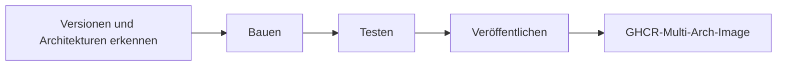

<div align="center">

**🌐 Sprachen**

[Türkçe](../../README.md) · [English](README.en.md) · [简体中文](README.zh-CN.md) · [繁體中文](README.zh-TW.md) · [日本語](README.ja.md) · [한국어](README.ko.md)

**Deutsch** · [Français](README.fr.md) · [Español](README.es.md) · [Português (Brasil)](README.pt-BR.md) · [Italiano](README.it.md) · [Русский](README.ru.md)

[Українська](README.uk.md) · [العربية](README.ar.md) · [فارسی](README.fa.md) · [हिन्दी](README.hi.md) · [Bahasa Indonesia](README.id.md) · [Tiếng Việt](README.vi.md)

</div>

---

# Low-Price-Hosting · Container

**Linux-Basis-Images für Container — aus Quellrezepten bauen, je Architektur testen und in GHCR veröffentlichen.**

[](https://github.com/Low-Price-Hosting/Container/actions/workflows/build-base-images.yml)
[](https://github.com/Low-Price-Hosting/Cron/actions/workflows/mirror-container-sources.yml)
[](https://github.com/orgs/Low-Price-Hosting/packages?ecosystem=container)

**8 Distributionen** · **Dynamische Versionen und Architekturen** · **Bauen → Testen → Veröffentlichen**

[Images](#images-and-downloads) · [Architekturen](#versions-and-architectures) · [Verwendung](#quick-start) · [Builds starten](#run-builds) · [Build-Ablauf](#pipeline) · [Image-Informationen](#oci-metadata)

---

<a id="images-and-downloads"></a>

## Images und Downloads

| Distribution | Image-Referenz | Tags und OS/Arch | Downloads insgesamt |
|---|---|---|---|
| [Ubuntu](https://github.com/Low-Price-Hosting/Ubuntu) | `ghcr.io/low-price-hosting/ubuntu` | [Pakete](https://github.com/orgs/Low-Price-Hosting/packages/container/package/ubuntu) | [](https://github.com/orgs/Low-Price-Hosting/packages/container/package/ubuntu) |
| [Debian](https://github.com/Low-Price-Hosting/Debian) | `ghcr.io/low-price-hosting/debian` | [Pakete](https://github.com/orgs/Low-Price-Hosting/packages/container/package/debian) | [](https://github.com/orgs/Low-Price-Hosting/packages/container/package/debian) |
| [CentOS Stream](https://github.com/Low-Price-Hosting/Centos) | `ghcr.io/low-price-hosting/centos` | [Pakete](https://github.com/orgs/Low-Price-Hosting/packages/container/package/centos) | [](https://github.com/orgs/Low-Price-Hosting/packages/container/package/centos) |
| [Alpine](https://github.com/Low-Price-Hosting/Alpine) | `ghcr.io/low-price-hosting/alpine` | [Pakete](https://github.com/orgs/Low-Price-Hosting/packages/container/package/alpine) | [](https://github.com/orgs/Low-Price-Hosting/packages/container/package/alpine) |
| [Fedora](https://github.com/Low-Price-Hosting/Fedora) | `ghcr.io/low-price-hosting/fedora` | [Pakete](https://github.com/orgs/Low-Price-Hosting/packages/container/package/fedora) | [](https://github.com/orgs/Low-Price-Hosting/packages/container/package/fedora) |
| [AlmaLinux](https://github.com/Low-Price-Hosting/AlmaLinux) | `ghcr.io/low-price-hosting/almalinux` | [Pakete](https://github.com/orgs/Low-Price-Hosting/packages/container/package/almalinux) | [](https://github.com/orgs/Low-Price-Hosting/packages/container/package/almalinux) |
| [Arch Linux](https://github.com/Low-Price-Hosting/ArchLinux) | `ghcr.io/low-price-hosting/archlinux` | [Pakete](https://github.com/orgs/Low-Price-Hosting/packages/container/package/archlinux) | [](https://github.com/orgs/Low-Price-Hosting/packages/container/package/archlinux) |
| [Rocky Linux](https://github.com/Low-Price-Hosting/RockyLinux) | `ghcr.io/low-price-hosting/rockylinux` | [Pakete](https://github.com/orgs/Low-Price-Hosting/packages/container/package/rockylinux) | [](https://github.com/orgs/Low-Price-Hosting/packages/container/package/rockylinux) |

Die Download-Badges zeigen den Wert **Gesamte Downloads** in GitHub Packages an. Downloads je Version und veröffentlichte Architekturen finden Sie auf der jeweiligen Paketseite. Durch Zwischenspeicherung können die Zähler verzögert aktualisiert werden; ein nicht lesbarer Zähler bedeutet nicht **0**.

<a id="versions-and-architectures"></a>

## Versions- und Architekturreferenzen

Versions- und Architekturreferenzen aus dem [Erkennungsplan vom 8. Oktober 2026](https://github.com/Low-Price-Hosting/Container/actions/runs/37741062225). Dies sind erkannte Ziele; prüfen Sie die veröffentlichten Architekturen im Feld **OS/Arch** des gewählten Tags oder im OCI-Index.

| Distribution | Versionen | Plattformen — mit dem Präfix `linux/` |
|---|---|---|
| Ubuntu | `22.04`, `24.04`, `26.04` | `amd64`, `arm/v7`, `arm64`, `ppc64le`, `riscv64`, `s390x` |
| Debian | `bookworm` | `386`, `amd64`, `arm/v7`, `arm64`, `ppc64le` |
| Debian | `trixie` | `386`, `amd64`, `arm/v5`, `arm/v7`, `arm64`, `ppc64le`, `riscv64`, `s390x` |
| CentOS Stream | `stream9`, `stream10` | `amd64`, `arm64`, `ppc64le`, `s390x` |
| Alpine | `3.21`, `3.22`, `3.23`, `3.24` | `386`, `amd64`, `arm/v6`, `arm/v7`, `arm64`, `ppc64le`, `riscv64`, `s390x` |
| Fedora | `43`, `44` | `amd64`, `arm64`, `ppc64le`, `s390x` |
| AlmaLinux | `8`, `9` | `386`, `amd64`, `arm64`, `ppc64le`, `s390x` |
| AlmaLinux | `10` | `386`, `amd64`, `amd64/v2`, `arm64`, `ppc64le`, `s390x` |
| Arch Linux | `rolling` | `amd64` |
| Rocky Linux | `8` | `amd64`, `arm64` |
| Rocky Linux | `9` | `amd64`, `arm64`, `ppc64le`, `s390x` |
| Rocky Linux | `10` | `amd64`, `arm64`, `ppc64le`, `riscv64`*, `s390x` |

\* Das Ziel `riscv64` für Rocky Linux 10 wurde in diesem Plan vom Build ausgeschlossen. Die Architekturen können je nach Version variieren.

Prüfen Sie die tatsächlichen Architekturen eines Tags:

```bash
docker buildx imagetools inspect ghcr.io/low-price-hosting/ubuntu:24.04
docker buildx imagetools inspect --raw ghcr.io/low-price-hosting/ubuntu:24.04
```

<a id="quick-start"></a>

## Schnellstart

Ersetzen Sie `24.04` in den Beispielen durch den **veröffentlichten Tag**, den Sie verwenden möchten. Zum Herunterladen öffentlicher Images ist keine GHCR-Anmeldung erforderlich.

### Herunterladen und ausführen

```bash
docker pull ghcr.io/low-price-hosting/ubuntu:24.04
docker run --rm -it ghcr.io/low-price-hosting/ubuntu:24.04 /bin/sh
```

Docker wählt aus dem Multi-Arch-Tag das Image aus, das zur Architektur Ihres Computers passt.

### Architektur auswählen

```bash
docker pull --platform linux/arm64 ghcr.io/low-price-hosting/ubuntu:24.04

docker run --rm --platform linux/arm64 \
  ghcr.io/low-price-hosting/ubuntu:24.04 \
  /bin/sh -c 'cat /etc/os-release'
```

Um ein Image für eine andere Prozessorfamilie auszuführen, ist eine passende Emulation erforderlich.

### Mit einem Digest festlegen

```bash
docker image inspect --format '{{json .RepoDigests}}' \
  ghcr.io/low-price-hosting/ubuntu:24.04

# Ersetzen Sie <digest> durch den SHA256-Wert des Images.
docker pull ghcr.io/low-price-hosting/ubuntu@sha256:<digest>
```

Versionstags können aktualisiert werden; mit einem Digest können Sie dasselbe Image erneut verwenden.

### In Ihrem eigenen Image verwenden

```dockerfile
FROM ghcr.io/low-price-hosting/ubuntu:24.04

COPY app/ /opt/app/
WORKDIR /opt/app
CMD ["/bin/sh"]
```

<a id="run-builds"></a>

## Builds starten

[Actions → Basis-Images bauen → Workflow ausführen](https://github.com/Low-Price-Hosting/Container/actions/workflows/build-base-images.yml):

| Feld | Verwendung |
|---|---|
| `distribution` | `all` oder der Name einer Distribution. |
| `version` | `all` oder eine genaue Version, etwa `24.04`, `trixie`, `stream10` oder `rolling`. |
| `verify_only` | `true`: erneut bauen/testen, ohne Veröffentlichung. `false`: geänderte oder fehlende Images bauen/testen und veröffentlichen. |

Alle erkannten Architekturen der gewählten Version werden verarbeitet. Mit der GitHub CLI:

```bash
# Geänderte oder fehlende Images aller Distributionen bauen und veröffentlichen.
gh workflow run build-base-images.yml \
  --repo Low-Price-Hosting/Container --ref main \
  -f distribution=all -f version=all -f verify_only=false

# Fedora-Images nur bauen und testen.
gh workflow run build-base-images.yml \
  --repo Low-Price-Hosting/Container --ref main \
  -f distribution=Fedora -f version=all -f verify_only=true
```

Das Build-Badge oben zeigt das Ergebnis des letzten Workflows an; ein Lauf zur reinen Überprüfung veröffentlicht keine Images.

<a id="pipeline"></a>

## Build-Ablauf



| Phase | Vorgang für das Image |
|---|---|
| **Bauen** | Das rootfs/Image wird mit dem Container-Build-Rezept der Distribution erstellt. |
| **Testen** | Das Image wird auf einem separaten Runner ausgeführt; Distributionskennung, Paketmanager, Architektur und Quell-Label werden geprüft. |
| **Veröffentlichen** | Wenn alle erwarteten Architekturen einer Version die Tests bestanden haben, wird der Multi-Arch-Versionstag veröffentlicht. |

Jedes Build-/Testziel verwendet einen separaten Runner. Die Tests prüfen grundlegende Funktionen; sie sind keine umfassenden Tests der Anwendungskompatibilität.

Neue Versionen und Architekturen werden automatisch aus den Quellkatalogen erkannt. Sie werden in den Build-Plan aufgenommen, sobald das zugehörige Rezept, der Quellbranch, das Bootstrap-Manifest und die Paketquellen bereitstehen. Die Quellen werden über den stündlichen Cron-Workflow aktualisiert; die GitHub-Zeitplanung kann sich verzögern.

<a id="oci-metadata"></a>

## Tags und Image-Informationen

| Referenz | Bedeutung |
|---|---|
| `ubuntu:24.04`, `debian:trixie`, `centos:stream10` | Multi-Arch-Tag mit den getesteten Architekturen der jeweiligen Version. |
| `latest` und andere Aliasse | Tags, die anhand des Versionskatalogs der Distribution festgelegt werden. |
| `<image>@sha256:<digest>` | Unveränderliche Referenz auf den Image-Inhalt. |

Quell-, Versions- und Build-Informationen des Images finden Sie in seinen OCI-Metadaten:

```bash
docker image inspect --format '{{json .Config.Labels}}' \
  ghcr.io/low-price-hosting/ubuntu:24.04
```

`org.opencontainers.image.source` verweist auf das Repository mit dem Quellrezept, `org.opencontainers.image.version` auf die Version und `io.low-price-hosting.build.source` auf den Build-Code. Der Multi-Arch-Index und die Architektur-Annotationen können mit `docker buildx imagetools inspect --raw` gelesen werden.
