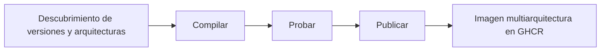

<div align="center">

**🌐 Idiomas**

[Türkçe](../../README.md) · [English](README.en.md) · [简体中文](README.zh-CN.md) · [繁體中文](README.zh-TW.md) · [日本語](README.ja.md) · [한국어](README.ko.md)

[Deutsch](README.de.md) · [Français](README.fr.md) · **Español** · [Português (Brasil)](README.pt-BR.md) · [Italiano](README.it.md) · [Русский](README.ru.md)

[Українська](README.uk.md) · [العربية](README.ar.md) · [فارسی](README.fa.md) · [हिन्दी](README.hi.md) · [Bahasa Indonesia](README.id.md) · [Tiếng Việt](README.vi.md)

</div>

---

# Low-Price-Hosting · Container

**Imágenes base de Linux para contenedores — compilación a partir de recetas fuente, pruebas por arquitectura y publicación en GHCR.**

[](https://github.com/Low-Price-Hosting/Container/actions/workflows/build-base-images.yml)
[](https://github.com/Low-Price-Hosting/Cron/actions/workflows/mirror-container-sources.yml)
[](https://github.com/orgs/Low-Price-Hosting/packages?ecosystem=container)

**8 distribuciones** · **Versiones y arquitecturas dinámicas** · **Compilar → Probar → Publicar**

[Imágenes](#images-and-downloads) · [Arquitecturas](#versions-and-architectures) · [Uso](#quick-start) · [Iniciar compilaciones](#run-builds) · [Flujo de compilación](#pipeline) · [Información de las imágenes](#oci-metadata)

---

<a id="images-and-downloads"></a>

## Imágenes y descargas

| Distribución | Referencia de la imagen | Etiquetas y OS/Arch | Descargas totales |
|---|---|---|---|
| [Ubuntu](https://github.com/Low-Price-Hosting/Ubuntu) | `ghcr.io/low-price-hosting/ubuntu` | [Paquetes](https://github.com/orgs/Low-Price-Hosting/packages/container/package/ubuntu) | [](https://github.com/orgs/Low-Price-Hosting/packages/container/package/ubuntu) |
| [Debian](https://github.com/Low-Price-Hosting/Debian) | `ghcr.io/low-price-hosting/debian` | [Paquetes](https://github.com/orgs/Low-Price-Hosting/packages/container/package/debian) | [](https://github.com/orgs/Low-Price-Hosting/packages/container/package/debian) |
| [CentOS Stream](https://github.com/Low-Price-Hosting/Centos) | `ghcr.io/low-price-hosting/centos` | [Paquetes](https://github.com/orgs/Low-Price-Hosting/packages/container/package/centos) | [](https://github.com/orgs/Low-Price-Hosting/packages/container/package/centos) |
| [Alpine](https://github.com/Low-Price-Hosting/Alpine) | `ghcr.io/low-price-hosting/alpine` | [Paquetes](https://github.com/orgs/Low-Price-Hosting/packages/container/package/alpine) | [](https://github.com/orgs/Low-Price-Hosting/packages/container/package/alpine) |
| [Fedora](https://github.com/Low-Price-Hosting/Fedora) | `ghcr.io/low-price-hosting/fedora` | [Paquetes](https://github.com/orgs/Low-Price-Hosting/packages/container/package/fedora) | [](https://github.com/orgs/Low-Price-Hosting/packages/container/package/fedora) |
| [AlmaLinux](https://github.com/Low-Price-Hosting/AlmaLinux) | `ghcr.io/low-price-hosting/almalinux` | [Paquetes](https://github.com/orgs/Low-Price-Hosting/packages/container/package/almalinux) | [](https://github.com/orgs/Low-Price-Hosting/packages/container/package/almalinux) |
| [Arch Linux](https://github.com/Low-Price-Hosting/ArchLinux) | `ghcr.io/low-price-hosting/archlinux` | [Paquetes](https://github.com/orgs/Low-Price-Hosting/packages/container/package/archlinux) | [](https://github.com/orgs/Low-Price-Hosting/packages/container/package/archlinux) |
| [Rocky Linux](https://github.com/Low-Price-Hosting/RockyLinux) | `ghcr.io/low-price-hosting/rockylinux` | [Paquetes](https://github.com/orgs/Low-Price-Hosting/packages/container/package/rockylinux) | [](https://github.com/orgs/Low-Price-Hosting/packages/container/package/rockylinux) |

Los indicadores de descarga muestran el valor **Descargas totales** de GitHub Packages. Las descargas por versión y las arquitecturas publicadas aparecen en la página del paquete correspondiente. La caché puede retrasar los contadores; un contador ilegible no significa **0**.

<a id="versions-and-architectures"></a>

## Referencias de versiones y arquitecturas

Referencias de versiones y arquitecturas del [plan de descubrimiento del 8 de octubre de 2026](https://github.com/Low-Price-Hosting/Container/actions/runs/37741062225). Son objetivos descubiertos; compruebe las arquitecturas publicadas en el campo **OS/Arch** de la etiqueta elegida o en su índice OCI.

| Distribución | Versiones | Plataformas — con el prefijo `linux/` |
|---|---|---|
| Ubuntu | `22.04`, `24.04`, `26.04` | `amd64`, `arm/v7`, `arm64`, `ppc64le`, `riscv64`, `s390x` |
| Debian | `bookworm` | `386`, `amd64`, `arm/v7`, `arm64`, `ppc64le` |
| Debian | `trixie` | `386`, `amd64`, `arm/v5`, `arm/v7`, `arm64`, `ppc64le`, `riscv64`, `s390x` |
| CentOS Stream | `stream9`, `stream10` | `amd64`, `arm64`, `ppc64le`, `s390x` |
| Alpine | `3.21`, `3.22`, `3.23`, `3.24` | `386`, `amd64`, `arm/v6`, `arm/v7`, `arm64`, `ppc64le`, `riscv64`, `s390x` |
| Fedora | `43`, `44` | `amd64`, `arm64`, `ppc64le`, `s390x` |
| AlmaLinux | `8`, `9` | `386`, `amd64`, `arm64`, `ppc64le`, `s390x` |
| AlmaLinux | `10` | `386`, `amd64`, `amd64/v2`, `arm64`, `ppc64le`, `s390x` |
| Arch Linux | `rolling` | `amd64` |
| Rocky Linux | `8` | `amd64`, `arm64` |
| Rocky Linux | `9` | `amd64`, `arm64`, `ppc64le`, `s390x` |
| Rocky Linux | `10` | `amd64`, `arm64`, `ppc64le`, `riscv64`*, `s390x` |

\* El objetivo `riscv64` de Rocky Linux 10 quedó excluido de la compilación en este plan. El conjunto de arquitecturas puede variar según la versión.

Examine las arquitecturas reales de una etiqueta:

```bash
docker buildx imagetools inspect ghcr.io/low-price-hosting/ubuntu:24.04
docker buildx imagetools inspect --raw ghcr.io/low-price-hosting/ubuntu:24.04
```

<a id="quick-start"></a>

## Inicio rápido

Sustituya `24.04` en los ejemplos por la **etiqueta publicada** que quiera utilizar. No hace falta iniciar sesión en GHCR para descargar imágenes públicas.

### Descargar y ejecutar

```bash
docker pull ghcr.io/low-price-hosting/ubuntu:24.04
docker run --rm -it ghcr.io/low-price-hosting/ubuntu:24.04 /bin/sh
```

Docker selecciona de la etiqueta multiarquitectura la imagen adecuada para la arquitectura de su equipo.

### Seleccionar una arquitectura

```bash
docker pull --platform linux/arm64 ghcr.io/low-price-hosting/ubuntu:24.04

docker run --rm --platform linux/arm64 \
  ghcr.io/low-price-hosting/ubuntu:24.04 \
  /bin/sh -c 'cat /etc/os-release'
```

Para ejecutar una imagen de otra familia de procesadores se necesita una emulación adecuada.

### Fijar mediante digest

```bash
docker image inspect --format '{{json .RepoDigests}}' \
  ghcr.io/low-price-hosting/ubuntu:24.04

# Sustituya <digest> por el valor SHA256 de la imagen.
docker pull ghcr.io/low-price-hosting/ubuntu@sha256:<digest>
```

Las etiquetas de versión pueden actualizarse; el digest permite volver a utilizar la misma imagen.

### Usar en su propia imagen

```dockerfile
FROM ghcr.io/low-price-hosting/ubuntu:24.04

COPY app/ /opt/app/
WORKDIR /opt/app
CMD ["/bin/sh"]
```

<a id="run-builds"></a>

## Iniciar compilaciones

[Actions → Compilar imágenes base → Ejecutar flujo de trabajo](https://github.com/Low-Price-Hosting/Container/actions/workflows/build-base-images.yml):

| Campo | Uso |
|---|---|
| `distribution` | `all` o el nombre de una distribución. |
| `version` | `all` o una versión exacta, como `24.04`, `trixie`, `stream10` o `rolling`. |
| `verify_only` | `true`: volver a compilar/probar sin publicar. `false`: compilar/probar y publicar las imágenes modificadas o faltantes. |

Se procesan todas las arquitecturas descubiertas de la versión seleccionada. Con GitHub CLI:

```bash
# Compilar y publicar las imágenes modificadas o faltantes de todas las distribuciones.
gh workflow run build-base-images.yml \
  --repo Low-Price-Hosting/Container --ref main \
  -f distribution=all -f version=all -f verify_only=false

# Solo compilar y probar las imágenes de Fedora.
gh workflow run build-base-images.yml \
  --repo Low-Price-Hosting/Container --ref main \
  -f distribution=Fedora -f version=all -f verify_only=true
```

El indicador de compilación de arriba muestra el resultado del último flujo de trabajo; una ejecución dedicada únicamente a la verificación no publica imágenes.

<a id="pipeline"></a>

## Flujo de compilación



| Etapa | Operación realizada sobre la imagen |
|---|---|
| **Compilar** | Se crea el rootfs/la imagen con la receta de construcción de contenedores de la distribución. |
| **Probar** | La imagen se ejecuta en un runner independiente; se comprueban la identidad de la distribución, el gestor de paquetes, la arquitectura y la etiqueta de origen. |
| **Publicar** | La etiqueta de versión multiarquitectura se publica cuando todas las arquitecturas esperadas de esa versión superan las pruebas. |

Cada objetivo de compilación/prueba utiliza un runner independiente. Las pruebas comprueban el funcionamiento básico; no son pruebas exhaustivas de compatibilidad de aplicaciones.

Las nuevas versiones y arquitecturas se descubren automáticamente en los catálogos fuente. Se incorporan al plan de compilación cuando están listos la receta correspondiente, la rama fuente, el manifiesto de arranque y los repositorios de paquetes. Las fuentes se actualizan mediante el flujo Cron de cada hora; la programación de GitHub puede retrasarse.

<a id="oci-metadata"></a>

## Etiquetas e información de las imágenes

| Referencia | Significado |
|---|---|
| `ubuntu:24.04`, `debian:trixie`, `centos:stream10` | Etiqueta multiarquitectura que contiene las arquitecturas probadas de la versión correspondiente. |
| `latest` y otros alias | Etiquetas determinadas según el catálogo de versiones de la distribución. |
| `<image>@sha256:<digest>` | Referencia inmutable al contenido de la imagen. |

La información de origen, versión y construcción de la imagen está en sus metadatos OCI:

```bash
docker image inspect --format '{{json .Config.Labels}}' \
  ghcr.io/low-price-hosting/ubuntu:24.04
```

`org.opencontainers.image.source` indica el repositorio de la receta fuente, `org.opencontainers.image.version` la versión e `io.low-price-hosting.build.source` el código de construcción. El índice multiarquitectura y las anotaciones de arquitectura se pueden consultar con `docker buildx imagetools inspect --raw`.
