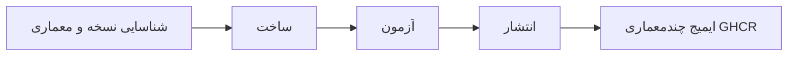

<div align="center">

**🌐 زبان‌ها**

[Türkçe](../../README.md) · [English](README.en.md) · [简体中文](README.zh-CN.md) · [繁體中文](README.zh-TW.md) · [日本語](README.ja.md) · [한국어](README.ko.md)

[Deutsch](README.de.md) · [Français](README.fr.md) · [Español](README.es.md) · [Português (Brasil)](README.pt-BR.md) · [Italiano](README.it.md) · [Русский](README.ru.md)

[Українська](README.uk.md) · [العربية](README.ar.md) · **فارسی** · [हिन्दी](README.hi.md) · [Bahasa Indonesia](README.id.md) · [Tiếng Việt](README.vi.md)

</div>

---

# Low-Price-Hosting · Container

**ایمیج‌های پایهٔ کانتینر Linux — ساخت از دستورهای منبع، آزمون برای هر معماری و انتشار در GHCR.**

[](https://github.com/Low-Price-Hosting/Container/actions/workflows/build-base-images.yml)
[](https://github.com/Low-Price-Hosting/Cron/actions/workflows/mirror-container-sources.yml)
[](https://github.com/orgs/Low-Price-Hosting/packages?ecosystem=container)

**8 توزیع** · **نسخه‌ها و معماری‌های پویا** · **ساخت → آزمون → انتشار**

[ایمیج‌ها](#images-and-downloads) · [معماری‌ها](#versions-and-architectures) · [استفاده](#quick-start) · [شروع ساخت](#run-builds) · [روند ساخت](#pipeline) · [اطلاعات ایمیج](#oci-metadata)

---

<a id="images-and-downloads"></a>

## ایمیج‌ها و دانلودها

| توزیع | مرجع ایمیج | برچسب‌ها و OS/Arch | مجموع دانلودها |
|---|---|---|---|
| [Ubuntu](https://github.com/Low-Price-Hosting/Ubuntu) | `ghcr.io/low-price-hosting/ubuntu` | [بسته‌ها](https://github.com/orgs/Low-Price-Hosting/packages/container/package/ubuntu) | [](https://github.com/orgs/Low-Price-Hosting/packages/container/package/ubuntu) |
| [Debian](https://github.com/Low-Price-Hosting/Debian) | `ghcr.io/low-price-hosting/debian` | [بسته‌ها](https://github.com/orgs/Low-Price-Hosting/packages/container/package/debian) | [](https://github.com/orgs/Low-Price-Hosting/packages/container/package/debian) |
| [CentOS Stream](https://github.com/Low-Price-Hosting/Centos) | `ghcr.io/low-price-hosting/centos` | [بسته‌ها](https://github.com/orgs/Low-Price-Hosting/packages/container/package/centos) | [](https://github.com/orgs/Low-Price-Hosting/packages/container/package/centos) |
| [Alpine](https://github.com/Low-Price-Hosting/Alpine) | `ghcr.io/low-price-hosting/alpine` | [بسته‌ها](https://github.com/orgs/Low-Price-Hosting/packages/container/package/alpine) | [](https://github.com/orgs/Low-Price-Hosting/packages/container/package/alpine) |
| [Fedora](https://github.com/Low-Price-Hosting/Fedora) | `ghcr.io/low-price-hosting/fedora` | [بسته‌ها](https://github.com/orgs/Low-Price-Hosting/packages/container/package/fedora) | [](https://github.com/orgs/Low-Price-Hosting/packages/container/package/fedora) |
| [AlmaLinux](https://github.com/Low-Price-Hosting/AlmaLinux) | `ghcr.io/low-price-hosting/almalinux` | [بسته‌ها](https://github.com/orgs/Low-Price-Hosting/packages/container/package/almalinux) | [](https://github.com/orgs/Low-Price-Hosting/packages/container/package/almalinux) |
| [Arch Linux](https://github.com/Low-Price-Hosting/ArchLinux) | `ghcr.io/low-price-hosting/archlinux` | [بسته‌ها](https://github.com/orgs/Low-Price-Hosting/packages/container/package/archlinux) | [](https://github.com/orgs/Low-Price-Hosting/packages/container/package/archlinux) |
| [Rocky Linux](https://github.com/Low-Price-Hosting/RockyLinux) | `ghcr.io/low-price-hosting/rockylinux` | [بسته‌ها](https://github.com/orgs/Low-Price-Hosting/packages/container/package/rockylinux) | [](https://github.com/orgs/Low-Price-Hosting/packages/container/package/rockylinux) |

نشان‌های دانلود، مقدار **مجموع دانلودها** در GitHub Packages را نشان می‌دهند. دانلودهای هر نسخه و معماری‌های منتشرشده در صفحهٔ بستهٔ مربوطه قرار دارند. به‌دلیل حافظهٔ نهان، شمارنده‌ها ممکن است با تأخیر به‌روز شوند؛ خوانده نشدن شمارنده به معنی **0** نیست.

<a id="versions-and-architectures"></a>

## مرجع نسخه‌ها و معماری‌ها

مرجع نسخه‌ها و معماری‌ها از [برنامهٔ شناسایی 8 اکتبر 2026](https://github.com/Low-Price-Hosting/Container/actions/runs/37741062225). این‌ها هدف‌های شناسایی‌شده هستند؛ معماری‌های منتشرشده را در فیلد **OS/Arch** برچسب انتخابی یا در نمایهٔ OCI بررسی کنید.

| توزیع | نسخه‌ها | سکوها — با پیشوند `linux/` |
|---|---|---|
| Ubuntu | `22.04`, `24.04`, `26.04` | `amd64`, `arm/v7`, `arm64`, `ppc64le`, `riscv64`, `s390x` |
| Debian | `bookworm` | `386`, `amd64`, `arm/v7`, `arm64`, `ppc64le` |
| Debian | `trixie` | `386`, `amd64`, `arm/v5`, `arm/v7`, `arm64`, `ppc64le`, `riscv64`, `s390x` |
| CentOS Stream | `stream9`, `stream10` | `amd64`, `arm64`, `ppc64le`, `s390x` |
| Alpine | `3.21`, `3.22`, `3.23`, `3.24` | `386`, `amd64`, `arm/v6`, `arm/v7`, `arm64`, `ppc64le`, `riscv64`, `s390x` |
| Fedora | `43`, `44` | `amd64`, `arm64`, `ppc64le`, `s390x` |
| AlmaLinux | `8`, `9` | `386`, `amd64`, `arm64`, `ppc64le`, `s390x` |
| AlmaLinux | `10` | `386`, `amd64`, `amd64/v2`, `arm64`, `ppc64le`, `s390x` |
| Arch Linux | `rolling` | `amd64` |
| Rocky Linux | `8` | `amd64`, `arm64` |
| Rocky Linux | `9` | `amd64`, `arm64`, `ppc64le`, `s390x` |
| Rocky Linux | `10` | `amd64`, `arm64`, `ppc64le`, `riscv64`*, `s390x` |

\* هدف Rocky Linux 10 `riscv64` در این برنامه از ساخت کنار گذاشته شد. مجموعهٔ معماری‌ها ممکن است بسته به نسخه متفاوت باشد.

معماری‌های واقعی یک برچسب را بررسی کنید:

```bash
docker buildx imagetools inspect ghcr.io/low-price-hosting/ubuntu:24.04
docker buildx imagetools inspect --raw ghcr.io/low-price-hosting/ubuntu:24.04
```

<a id="quick-start"></a>

## استفادهٔ سریع

به‌جای `24.04` در مثال‌ها، **برچسب منتشرشده‌ای** را که می‌خواهید استفاده کنید انتخاب کنید. برای دانلود ایمیج‌های عمومی نیازی به ورود به GHCR نیست.

### دانلود و اجرا

```bash
docker pull ghcr.io/low-price-hosting/ubuntu:24.04
docker run --rm -it ghcr.io/low-price-hosting/ubuntu:24.04 /bin/sh
```

Docker از برچسب چندمعماری، ایمیج مناسب معماری رایانهٔ شما را انتخاب می‌کند.

### انتخاب معماری

```bash
docker pull --platform linux/arm64 ghcr.io/low-price-hosting/ubuntu:24.04

docker run --rm --platform linux/arm64 \
  ghcr.io/low-price-hosting/ubuntu:24.04 \
  /bin/sh -c 'cat /etc/os-release'
```

برای اجرای ایمیجی از خانوادهٔ پردازندهٔ متفاوت، به شبیه‌سازی مناسب نیاز است.

### ثابت کردن با چکیده

```bash
docker image inspect --format '{{json .RepoDigests}}' \
  ghcr.io/low-price-hosting/ubuntu:24.04

# به‌جای <digest> مقدار SHA256 ایمیج را بنویسید.
docker pull ghcr.io/low-price-hosting/ubuntu@sha256:<digest>
```

برچسب‌های نسخه ممکن است به‌روز شوند؛ چکیده امکان استفادهٔ دوباره از همان ایمیج را فراهم می‌کند.

### استفاده در ایمیج خودتان

```dockerfile
FROM ghcr.io/low-price-hosting/ubuntu:24.04

COPY app/ /opt/app/
WORKDIR /opt/app
CMD ["/bin/sh"]
```

<a id="run-builds"></a>

## شروع ساخت

[اقدام‌ها → ساخت ایمیج‌های پایه → اجرای گردش کار](https://github.com/Low-Price-Hosting/Container/actions/workflows/build-base-images.yml):

| فیلد | کاربرد |
|---|---|
| `distribution` | `all` یا نام یک توزیع. |
| `version` | `all` یا نسخهٔ دقیق، مانند `24.04`، `trixie`، `stream10`، `rolling`. |
| `verify_only` | `true`: ساخت و آزمون دوباره، بدون انتشار. `false`: ساخت، آزمون و انتشار ایمیج‌های تغییریافته یا ناموجود. |

همهٔ معماری‌های شناسایی‌شدهٔ نسخهٔ انتخابی پردازش می‌شوند. با GitHub CLI:

```bash
# ایمیج‌های تغییریافته یا ناموجود را برای همهٔ توزیع‌ها بسازید و منتشر کنید.
gh workflow run build-base-images.yml \
  --repo Low-Price-Hosting/Container --ref main \
  -f distribution=all -f version=all -f verify_only=false

# ایمیج‌های Fedora را فقط بسازید و آزمایش کنید.
gh workflow run build-base-images.yml \
  --repo Low-Price-Hosting/Container --ref main \
  -f distribution=Fedora -f version=all -f verify_only=true
```

نشان ساخت در بالا، نتیجهٔ آخرین گردش کار را نشان می‌دهد؛ اجرایی که فقط برای اعتبارسنجی باشد، ایمیجی منتشر نمی‌کند.

<a id="pipeline"></a>

## روند ساخت



| مرحله | عملیات انجام‌شده برای ایمیج |
|---|---|
| **ساخت** | سامانهٔ فایل ریشه/ایمیج با دستور ساخت کانتینر آن توزیع ایجاد می‌شود. |
| **آزمون** | ایمیج روی اجراکننده‌ای جداگانه اجرا می‌شود؛ شناسهٔ توزیع، مدیر بسته، معماری و برچسب منبع بررسی می‌شوند. |
| **انتشار** | پس از موفقیت همهٔ معماری‌های مورد انتظار یک نسخه در آزمون، برچسب نسخهٔ چندمعماری منتشر می‌شود. |

هر هدف ساخت و آزمون از اجراکننده‌ای جداگانه استفاده می‌کند. آزمون‌ها بررسی‌های پایهٔ عملکرد هستند؛ آزمون جامع سازگاری برنامه‌ها نیستند.

نسخه‌ها و معماری‌های جدید به‌طور خودکار از فهرست‌های منابع شناسایی می‌شوند. وقتی دستور مربوطه، شاخهٔ منبع، مانیفست راه‌اندازی اولیه و مخزن‌های بسته آماده باشند، به برنامهٔ ساخت اضافه می‌شوند. منابع از طریق گردش کار ساعتی Cron به‌روز می‌شوند؛ زمان‌بندی GitHub ممکن است با تأخیر اجرا شود.

<a id="oci-metadata"></a>

## برچسب‌ها و اطلاعات ایمیج

| مرجع | معنی |
|---|---|
| `ubuntu:24.04`, `debian:trixie`, `centos:stream10` | برچسب چندمعماری که معماری‌های آزمایش‌شدهٔ نسخهٔ مربوطه را در بر دارد. |
| `latest` و نام‌های مستعار دیگر | برچسب‌هایی که بر اساس فهرست نسخه‌های توزیع تعیین می‌شوند. |
| `<image>@sha256:<digest>` | مرجع تغییرناپذیر محتوای ایمیج. |

اطلاعات منبع، نسخه و ساخت ایمیج در فرادادهٔ OCI قرار دارند:

```bash
docker image inspect --format '{{json .Config.Labels}}' \
  ghcr.io/low-price-hosting/ubuntu:24.04
```

`org.opencontainers.image.source` مخزن دستور منبع، `org.opencontainers.image.version` نسخه و `io.low-price-hosting.build.source` کد ساخت را نشان می‌دهد. نمایهٔ چندمعماری و توضیحات معماری‌ها با `docker buildx imagetools inspect --raw` قابل خواندن هستند.
