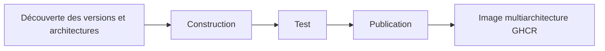

<div align="center">

**🌐 Langues**

[Türkçe](../../README.md) · [English](README.en.md) · [简体中文](README.zh-CN.md) · [繁體中文](README.zh-TW.md) · [日本語](README.ja.md) · [한국어](README.ko.md)

[Deutsch](README.de.md) · **Français** · [Español](README.es.md) · [Português (Brasil)](README.pt-BR.md) · [Italiano](README.it.md) · [Русский](README.ru.md)

[Українська](README.uk.md) · [العربية](README.ar.md) · [فارسی](README.fa.md) · [हिन्दी](README.hi.md) · [Bahasa Indonesia](README.id.md) · [Tiếng Việt](README.vi.md)

</div>

---

# Low-Price-Hosting · Container

**Images de base Linux pour conteneurs — construction à partir des recettes sources, tests par architecture et publication sur GHCR.**

[](https://github.com/Low-Price-Hosting/Container/actions/workflows/build-base-images.yml)
[](https://github.com/Low-Price-Hosting/Cron/actions/workflows/mirror-container-sources.yml)
[](https://github.com/orgs/Low-Price-Hosting/packages?ecosystem=container)

**8 distributions** · **Versions et architectures dynamiques** · **Construction → Test → Publication**

[Images](#images-and-downloads) · [Architectures](#versions-and-architectures) · [Utilisation](#quick-start) · [Lancer les constructions](#run-builds) · [Flux de construction](#pipeline) · [Informations sur les images](#oci-metadata)

---

<a id="images-and-downloads"></a>

## Images et téléchargements

| Distribution | Référence de l’image | Étiquettes et OS/Arch | Total des téléchargements |
|---|---|---|---|
| [Ubuntu](https://github.com/Low-Price-Hosting/Ubuntu) | `ghcr.io/low-price-hosting/ubuntu` | [Paquets](https://github.com/orgs/Low-Price-Hosting/packages/container/package/ubuntu) | [](https://github.com/orgs/Low-Price-Hosting/packages/container/package/ubuntu) |
| [Debian](https://github.com/Low-Price-Hosting/Debian) | `ghcr.io/low-price-hosting/debian` | [Paquets](https://github.com/orgs/Low-Price-Hosting/packages/container/package/debian) | [](https://github.com/orgs/Low-Price-Hosting/packages/container/package/debian) |
| [CentOS Stream](https://github.com/Low-Price-Hosting/Centos) | `ghcr.io/low-price-hosting/centos` | [Paquets](https://github.com/orgs/Low-Price-Hosting/packages/container/package/centos) | [](https://github.com/orgs/Low-Price-Hosting/packages/container/package/centos) |
| [Alpine](https://github.com/Low-Price-Hosting/Alpine) | `ghcr.io/low-price-hosting/alpine` | [Paquets](https://github.com/orgs/Low-Price-Hosting/packages/container/package/alpine) | [](https://github.com/orgs/Low-Price-Hosting/packages/container/package/alpine) |
| [Fedora](https://github.com/Low-Price-Hosting/Fedora) | `ghcr.io/low-price-hosting/fedora` | [Paquets](https://github.com/orgs/Low-Price-Hosting/packages/container/package/fedora) | [](https://github.com/orgs/Low-Price-Hosting/packages/container/package/fedora) |
| [AlmaLinux](https://github.com/Low-Price-Hosting/AlmaLinux) | `ghcr.io/low-price-hosting/almalinux` | [Paquets](https://github.com/orgs/Low-Price-Hosting/packages/container/package/almalinux) | [](https://github.com/orgs/Low-Price-Hosting/packages/container/package/almalinux) |
| [Arch Linux](https://github.com/Low-Price-Hosting/ArchLinux) | `ghcr.io/low-price-hosting/archlinux` | [Paquets](https://github.com/orgs/Low-Price-Hosting/packages/container/package/archlinux) | [](https://github.com/orgs/Low-Price-Hosting/packages/container/package/archlinux) |
| [Rocky Linux](https://github.com/Low-Price-Hosting/RockyLinux) | `ghcr.io/low-price-hosting/rockylinux` | [Paquets](https://github.com/orgs/Low-Price-Hosting/packages/container/package/rockylinux) | [](https://github.com/orgs/Low-Price-Hosting/packages/container/package/rockylinux) |

Les badges de téléchargement affichent la valeur **Total des téléchargements** de GitHub Packages. Les téléchargements par version et les architectures publiées figurent sur la page du paquet concerné. La mise en cache peut retarder les compteurs ; un compteur illisible ne signifie pas **0**.

<a id="versions-and-architectures"></a>

## Références des versions et architectures

Références des versions et architectures issues du [plan de découverte du 8 octobre 2026](https://github.com/Low-Price-Hosting/Container/actions/runs/37741062225). Il s’agit de cibles découvertes ; vérifiez les architectures publiées dans le champ **OS/Arch** de l’étiquette choisie ou dans son index OCI.

| Distribution | Versions | Plateformes — avec le préfixe `linux/` |
|---|---|---|
| Ubuntu | `22.04`, `24.04`, `26.04` | `amd64`, `arm/v7`, `arm64`, `ppc64le`, `riscv64`, `s390x` |
| Debian | `bookworm` | `386`, `amd64`, `arm/v7`, `arm64`, `ppc64le` |
| Debian | `trixie` | `386`, `amd64`, `arm/v5`, `arm/v7`, `arm64`, `ppc64le`, `riscv64`, `s390x` |
| CentOS Stream | `stream9`, `stream10` | `amd64`, `arm64`, `ppc64le`, `s390x` |
| Alpine | `3.21`, `3.22`, `3.23`, `3.24` | `386`, `amd64`, `arm/v6`, `arm/v7`, `arm64`, `ppc64le`, `riscv64`, `s390x` |
| Fedora | `43`, `44` | `amd64`, `arm64`, `ppc64le`, `s390x` |
| AlmaLinux | `8`, `9` | `386`, `amd64`, `arm64`, `ppc64le`, `s390x` |
| AlmaLinux | `10` | `386`, `amd64`, `amd64/v2`, `arm64`, `ppc64le`, `s390x` |
| Arch Linux | `rolling` | `amd64` |
| Rocky Linux | `8` | `amd64`, `arm64` |
| Rocky Linux | `9` | `amd64`, `arm64`, `ppc64le`, `s390x` |
| Rocky Linux | `10` | `amd64`, `arm64`, `ppc64le`, `riscv64`*, `s390x` |

\* La cible `riscv64` de Rocky Linux 10 a été exclue de la construction dans ce plan. Les architectures disponibles peuvent varier selon la version.

Examinez les architectures réelles d’une étiquette :

```bash
docker buildx imagetools inspect ghcr.io/low-price-hosting/ubuntu:24.04
docker buildx imagetools inspect --raw ghcr.io/low-price-hosting/ubuntu:24.04
```

<a id="quick-start"></a>

## Démarrage rapide

Remplacez `24.04` dans les exemples par l’**étiquette publiée** que vous souhaitez utiliser. Aucune connexion à GHCR n’est nécessaire pour télécharger les images publiques.

### Télécharger et exécuter

```bash
docker pull ghcr.io/low-price-hosting/ubuntu:24.04
docker run --rm -it ghcr.io/low-price-hosting/ubuntu:24.04 /bin/sh
```

Docker sélectionne dans l’étiquette multiarchitecture l’image adaptée à l’architecture de votre ordinateur.

### Choisir une architecture

```bash
docker pull --platform linux/arm64 ghcr.io/low-price-hosting/ubuntu:24.04

docker run --rm --platform linux/arm64 \
  ghcr.io/low-price-hosting/ubuntu:24.04 \
  /bin/sh -c 'cat /etc/os-release'
```

L’exécution d’une image destinée à une autre famille de processeurs nécessite une émulation appropriée.

### Fixer l’image par son digest

```bash
docker image inspect --format '{{json .RepoDigests}}' \
  ghcr.io/low-price-hosting/ubuntu:24.04

# Remplacez <digest> par la valeur SHA256 de l’image.
docker pull ghcr.io/low-price-hosting/ubuntu@sha256:<digest>
```

Les étiquettes de version peuvent être mises à jour ; le digest permet de réutiliser exactement la même image.

### Utiliser dans votre propre image

```dockerfile
FROM ghcr.io/low-price-hosting/ubuntu:24.04

COPY app/ /opt/app/
WORKDIR /opt/app
CMD ["/bin/sh"]
```

<a id="run-builds"></a>

## Lancer les constructions

[Actions → Construire les images de base → Exécuter le workflow](https://github.com/Low-Price-Hosting/Container/actions/workflows/build-base-images.yml):

| Champ | Utilisation |
|---|---|
| `distribution` | `all` ou le nom d’une distribution. |
| `version` | `all` ou une version exacte, comme `24.04`, `trixie`, `stream10` ou `rolling`. |
| `verify_only` | `true` : reconstruire/tester sans publication. `false` : construire/tester et publier les images modifiées ou manquantes. |

Toutes les architectures découvertes pour la version choisie sont traitées. Avec GitHub CLI :

```bash
# Construire et publier les images modifiées ou manquantes de toutes les distributions.
gh workflow run build-base-images.yml \
  --repo Low-Price-Hosting/Container --ref main \
  -f distribution=all -f version=all -f verify_only=false

# Construire et tester uniquement les images Fedora.
gh workflow run build-base-images.yml \
  --repo Low-Price-Hosting/Container --ref main \
  -f distribution=Fedora -f version=all -f verify_only=true
```

Le badge de construction ci-dessus indique le résultat du dernier workflow ; une exécution limitée à la vérification ne publie aucune image.

<a id="pipeline"></a>

## Flux de construction



| Étape | Opération effectuée sur l’image |
|---|---|
| **Construction** | Le rootfs/l’image est créé à partir de la recette de construction de conteneurs de la distribution. |
| **Test** | L’image est exécutée sur un runner distinct ; l’identité de la distribution, le gestionnaire de paquets, l’architecture et le label de source sont vérifiés. |
| **Publication** | L’étiquette de version multiarchitecture est publiée lorsque toutes les architectures attendues pour cette version ont réussi les tests. |

Chaque cible de construction/test utilise un runner distinct. Les tests vérifient le fonctionnement de base ; ils ne constituent pas des tests complets de compatibilité des applications.

Les nouvelles versions et architectures sont découvertes automatiquement à partir des catalogues sources. Elles sont intégrées au plan de construction lorsque la recette correspondante, la branche source, le manifeste d’amorçage et les dépôts de paquets sont prêts. Les sources sont mises à jour par le workflow Cron horaire ; la planification GitHub peut prendre du retard.

<a id="oci-metadata"></a>

## Étiquettes et informations sur les images

| Référence | Signification |
|---|---|
| `ubuntu:24.04`, `debian:trixie`, `centos:stream10` | Étiquette multiarchitecture contenant les architectures testées de la version concernée. |
| `latest` et autres alias | Étiquettes définies selon le catalogue de versions de la distribution. |
| `<image>@sha256:<digest>` | Référence immuable au contenu de l’image. |

Les informations sur la source, la version et la construction de l’image figurent dans ses métadonnées OCI :

```bash
docker image inspect --format '{{json .Config.Labels}}' \
  ghcr.io/low-price-hosting/ubuntu:24.04
```

`org.opencontainers.image.source` indique le dépôt de la recette source, `org.opencontainers.image.version` la version et `io.low-price-hosting.build.source` le code de construction. L’index multiarchitecture et les annotations d’architecture peuvent être consultés avec `docker buildx imagetools inspect --raw`.
