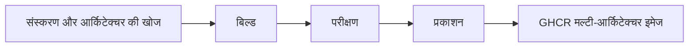

<div align="center">

**🌐 भाषाएँ**

[Türkçe](../../README.md) · [English](README.en.md) · [简体中文](README.zh-CN.md) · [繁體中文](README.zh-TW.md) · [日本語](README.ja.md) · [한국어](README.ko.md)

[Deutsch](README.de.md) · [Français](README.fr.md) · [Español](README.es.md) · [Português (Brasil)](README.pt-BR.md) · [Italiano](README.it.md) · [Русский](README.ru.md)

[Українська](README.uk.md) · [العربية](README.ar.md) · [فارسی](README.fa.md) · **हिन्दी** · [Bahasa Indonesia](README.id.md) · [Tiếng Việt](README.vi.md)

</div>

---

# Low-Price-Hosting · Container

**Linux के बेस कंटेनर इमेज — स्रोत की बिल्ड रेसिपी से तैयार, हर आर्किटेक्चर पर परीक्षण किए गए और GHCR पर प्रकाशित।**

[](https://github.com/Low-Price-Hosting/Container/actions/workflows/build-base-images.yml)
[](https://github.com/Low-Price-Hosting/Cron/actions/workflows/mirror-container-sources.yml)
[](https://github.com/orgs/Low-Price-Hosting/packages?ecosystem=container)

**8 वितरण** · **गतिशील संस्करण और आर्किटेक्चर** · **बिल्ड → परीक्षण → प्रकाशन**

[इमेज](#images-and-downloads) · [आर्किटेक्चर](#versions-and-architectures) · [उपयोग](#quick-start) · [बिल्ड शुरू करना](#run-builds) · [बिल्ड प्रक्रिया](#pipeline) · [इमेज की जानकारी](#oci-metadata)

---

<a id="images-and-downloads"></a>

## इमेज और डाउनलोड

| वितरण | इमेज संदर्भ | टैग और OS/Arch | कुल डाउनलोड |
|---|---|---|---|
| [Ubuntu](https://github.com/Low-Price-Hosting/Ubuntu) | `ghcr.io/low-price-hosting/ubuntu` | [पैकेज](https://github.com/orgs/Low-Price-Hosting/packages/container/package/ubuntu) | [](https://github.com/orgs/Low-Price-Hosting/packages/container/package/ubuntu) |
| [Debian](https://github.com/Low-Price-Hosting/Debian) | `ghcr.io/low-price-hosting/debian` | [पैकेज](https://github.com/orgs/Low-Price-Hosting/packages/container/package/debian) | [](https://github.com/orgs/Low-Price-Hosting/packages/container/package/debian) |
| [CentOS Stream](https://github.com/Low-Price-Hosting/Centos) | `ghcr.io/low-price-hosting/centos` | [पैकेज](https://github.com/orgs/Low-Price-Hosting/packages/container/package/centos) | [](https://github.com/orgs/Low-Price-Hosting/packages/container/package/centos) |
| [Alpine](https://github.com/Low-Price-Hosting/Alpine) | `ghcr.io/low-price-hosting/alpine` | [पैकेज](https://github.com/orgs/Low-Price-Hosting/packages/container/package/alpine) | [](https://github.com/orgs/Low-Price-Hosting/packages/container/package/alpine) |
| [Fedora](https://github.com/Low-Price-Hosting/Fedora) | `ghcr.io/low-price-hosting/fedora` | [पैकेज](https://github.com/orgs/Low-Price-Hosting/packages/container/package/fedora) | [](https://github.com/orgs/Low-Price-Hosting/packages/container/package/fedora) |
| [AlmaLinux](https://github.com/Low-Price-Hosting/AlmaLinux) | `ghcr.io/low-price-hosting/almalinux` | [पैकेज](https://github.com/orgs/Low-Price-Hosting/packages/container/package/almalinux) | [](https://github.com/orgs/Low-Price-Hosting/packages/container/package/almalinux) |
| [Arch Linux](https://github.com/Low-Price-Hosting/ArchLinux) | `ghcr.io/low-price-hosting/archlinux` | [पैकेज](https://github.com/orgs/Low-Price-Hosting/packages/container/package/archlinux) | [](https://github.com/orgs/Low-Price-Hosting/packages/container/package/archlinux) |
| [Rocky Linux](https://github.com/Low-Price-Hosting/RockyLinux) | `ghcr.io/low-price-hosting/rockylinux` | [पैकेज](https://github.com/orgs/Low-Price-Hosting/packages/container/package/rockylinux) | [](https://github.com/orgs/Low-Price-Hosting/packages/container/package/rockylinux) |

डाउनलोड बैज GitHub Packages का **Total downloads (कुल डाउनलोड)** मान दिखाते हैं। हर संस्करण के डाउनलोड और प्रकाशित आर्किटेक्चर संबंधित पैकेज पृष्ठ पर मिलते हैं। कैश के कारण काउंटर अपडेट में देर हो सकती है; काउंटर पढ़ा न जा सके तो इसका अर्थ **0 नहीं है**।

<a id="versions-and-architectures"></a>

## संस्करण और आर्किटेक्चर के संदर्भ

[8 अक्टूबर 2026 की खोज योजना](https://github.com/Low-Price-Hosting/Container/actions/runs/37741062225) से संस्करण और आर्किटेक्चर के संदर्भ। ये खोजे गए लक्ष्य हैं; प्रकाशित आर्किटेक्चर चुने गए टैग के **OS/Arch** फ़ील्ड या OCI इंडेक्स में जाँचें।

| वितरण | संस्करण | प्लेटफ़ॉर्म — `linux/` उपसर्ग के साथ |
|---|---|---|
| Ubuntu | `22.04`, `24.04`, `26.04` | `amd64`, `arm/v7`, `arm64`, `ppc64le`, `riscv64`, `s390x` |
| Debian | `bookworm` | `386`, `amd64`, `arm/v7`, `arm64`, `ppc64le` |
| Debian | `trixie` | `386`, `amd64`, `arm/v5`, `arm/v7`, `arm64`, `ppc64le`, `riscv64`, `s390x` |
| CentOS Stream | `stream9`, `stream10` | `amd64`, `arm64`, `ppc64le`, `s390x` |
| Alpine | `3.21`, `3.22`, `3.23`, `3.24` | `386`, `amd64`, `arm/v6`, `arm/v7`, `arm64`, `ppc64le`, `riscv64`, `s390x` |
| Fedora | `43`, `44` | `amd64`, `arm64`, `ppc64le`, `s390x` |
| AlmaLinux | `8`, `9` | `386`, `amd64`, `arm64`, `ppc64le`, `s390x` |
| AlmaLinux | `10` | `386`, `amd64`, `amd64/v2`, `arm64`, `ppc64le`, `s390x` |
| Arch Linux | `rolling` | `amd64` |
| Rocky Linux | `8` | `amd64`, `arm64` |
| Rocky Linux | `9` | `amd64`, `arm64`, `ppc64le`, `s390x` |
| Rocky Linux | `10` | `amd64`, `arm64`, `ppc64le`, `riscv64`*, `s390x` |

\* इस योजना में Rocky Linux 10 का `riscv64` लक्ष्य बिल्ड से बाहर रखा गया था। आर्किटेक्चर का समूह संस्करण के अनुसार बदल सकता है।

किसी टैग के वास्तविक आर्किटेक्चर जाँचें:

```bash
docker buildx imagetools inspect ghcr.io/low-price-hosting/ubuntu:24.04
docker buildx imagetools inspect --raw ghcr.io/low-price-hosting/ubuntu:24.04
```

<a id="quick-start"></a>

## जल्दी शुरू करें

उदाहरणों में `24.04` की जगह वह **प्रकाशित टैग** चुनें जिसे आप इस्तेमाल करना चाहते हैं। सार्वजनिक इमेज डाउनलोड करने के लिए GHCR में लॉगिन की ज़रूरत नहीं है।

### डाउनलोड करें और चलाएँ

```bash
docker pull ghcr.io/low-price-hosting/ubuntu:24.04
docker run --rm -it ghcr.io/low-price-hosting/ubuntu:24.04 /bin/sh
```

Docker मल्टी-आर्किटेक्चर टैग से आपके कंप्यूटर के आर्किटेक्चर के अनुरूप इमेज चुनता है।

### आर्किटेक्चर चुनें

```bash
docker pull --platform linux/arm64 ghcr.io/low-price-hosting/ubuntu:24.04

docker run --rm --platform linux/arm64 \
  ghcr.io/low-price-hosting/ubuntu:24.04 \
  /bin/sh -c 'cat /etc/os-release'
```

किसी अलग प्रोसेसर परिवार के लिए बनी इमेज चलाने के लिए उपयुक्त एमुलेशन चाहिए।

### डाइजेस्ट से तय करें

```bash
docker image inspect --format '{{json .RepoDigests}}' \
  ghcr.io/low-price-hosting/ubuntu:24.04

# <digest> की जगह इमेज का SHA256 मान लिखें।
docker pull ghcr.io/low-price-hosting/ubuntu@sha256:<digest>
```

संस्करण टैग अपडेट हो सकते हैं; डाइजेस्ट उसी इमेज को दोबारा इस्तेमाल करने देता है।

### अपनी इमेज में इस्तेमाल करें

```dockerfile
FROM ghcr.io/low-price-hosting/ubuntu:24.04

COPY app/ /opt/app/
WORKDIR /opt/app
CMD ["/bin/sh"]
```

<a id="run-builds"></a>

## बिल्ड शुरू करना

[कार्रवाइयाँ → बेस इमेज बिल्ड करें → वर्कफ़्लो चलाएँ](https://github.com/Low-Price-Hosting/Container/actions/workflows/build-base-images.yml):

| फ़ील्ड | उपयोग |
|---|---|
| `distribution` | `all` या किसी वितरण का नाम। |
| `version` | `all` या सटीक संस्करण, जैसे `24.04`, `trixie`, `stream10`, `rolling`। |
| `verify_only` | `true`: दोबारा बिल्ड और परीक्षण, कोई प्रकाशन नहीं। `false`: बदली हुई या मौजूद न होने वाली इमेज बिल्ड करें, परीक्षण करें और प्रकाशित करें। |

चुने गए संस्करण के सभी खोजे गए आर्किटेक्चर पर काम किया जाता है। GitHub CLI के साथ:

```bash
# सभी वितरणों की बदली हुई या मौजूद न होने वाली इमेज बिल्ड और प्रकाशित करें।
gh workflow run build-base-images.yml \
  --repo Low-Price-Hosting/Container --ref main \
  -f distribution=all -f version=all -f verify_only=false

# Fedora इमेज का केवल बिल्ड और परीक्षण करें।
gh workflow run build-base-images.yml \
  --repo Low-Price-Hosting/Container --ref main \
  -f distribution=Fedora -f version=all -f verify_only=true
```

ऊपर का बिल्ड बैज नवीनतम वर्कफ़्लो परिणाम दिखाता है; केवल सत्यापन करने वाला रन इमेज प्रकाशित नहीं करता।

<a id="pipeline"></a>

## बिल्ड प्रक्रिया



| चरण | इमेज के लिए होने वाली कार्रवाई |
|---|---|
| **बिल्ड** | वितरण की कंटेनर बनाने की रेसिपी से rootfs/इमेज तैयार की जाती है। |
| **परीक्षण** | इमेज अलग रनर पर चलाई जाती है; वितरण की पहचान, पैकेज प्रबंधक, आर्किटेक्चर और स्रोत लेबल की जाँच होती है। |
| **प्रकाशन** | किसी संस्करण के सभी अपेक्षित आर्किटेक्चर परीक्षण पास कर लें, तब उसका मल्टी-आर्किटेक्चर संस्करण टैग प्रकाशित होता है। |

हर बिल्ड/परीक्षण लक्ष्य अलग रनर इस्तेमाल करता है। ये बुनियादी संचालन जाँच हैं; एप्लिकेशन अनुकूलता का व्यापक परीक्षण नहीं हैं।

नए संस्करण और आर्किटेक्चर स्रोत कैटलॉग से अपने आप खोजे जाते हैं। संबंधित रेसिपी, स्रोत ब्रांच, बूटस्ट्रैप मैनिफ़ेस्ट और पैकेज रिपॉज़िटरी तैयार होने पर उन्हें बिल्ड योजना में शामिल किया जाता है। स्रोत हर घंटे चलने वाली Cron प्रक्रिया से अपडेट होते हैं; GitHub के निर्धारित रन में देर हो सकती है।

<a id="oci-metadata"></a>

## टैग और इमेज की जानकारी

| संदर्भ | अर्थ |
|---|---|
| `ubuntu:24.04`, `debian:trixie`, `centos:stream10` | संबंधित संस्करण के परीक्षण किए गए आर्किटेक्चर वाला मल्टी-आर्किटेक्चर टैग। |
| `latest` और अन्य उपनाम | वितरण के संस्करण कैटलॉग के अनुसार तय किए गए टैग। |
| `<image>@sha256:<digest>` | इमेज की सामग्री का अपरिवर्तनीय संदर्भ। |

इमेज के स्रोत, संस्करण और निर्माण की जानकारी OCI मेटाडेटा में मिलती है:

```bash
docker image inspect --format '{{json .Config.Labels}}' \
  ghcr.io/low-price-hosting/ubuntu:24.04
```

`org.opencontainers.image.source` स्रोत रेसिपी की रिपॉज़िटरी, `org.opencontainers.image.version` संस्करण और `io.low-price-hosting.build.source` निर्माण कोड बताता है। मल्टी-आर्किटेक्चर इंडेक्स और आर्किटेक्चर एनोटेशन `docker buildx imagetools inspect --raw` से पढ़े जा सकते हैं।
