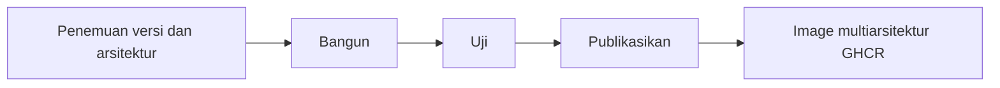

<div align="center">

**🌐 Bahasa**

[Türkçe](../../README.md) · [English](README.en.md) · [简体中文](README.zh-CN.md) · [繁體中文](README.zh-TW.md) · [日本語](README.ja.md) · [한국어](README.ko.md)

[Deutsch](README.de.md) · [Français](README.fr.md) · [Español](README.es.md) · [Português (Brasil)](README.pt-BR.md) · [Italiano](README.it.md) · [Русский](README.ru.md)

[Українська](README.uk.md) · [العربية](README.ar.md) · [فارسی](README.fa.md) · [हिन्दी](README.hi.md) · **Bahasa Indonesia** · [Tiếng Việt](README.vi.md)

</div>

---

# Low-Price-Hosting · Container

**Image dasar Linux untuk container — dibangun dari resep sumber, diuji per arsitektur, dan dipublikasikan ke GHCR.**

[](https://github.com/Low-Price-Hosting/Container/actions/workflows/build-base-images.yml)
[](https://github.com/Low-Price-Hosting/Cron/actions/workflows/mirror-container-sources.yml)
[](https://github.com/orgs/Low-Price-Hosting/packages?ecosystem=container)

**8 distribusi** · **Versi dan arsitektur dinamis** · **Bangun → Uji → Publikasikan**

[Image](#images-and-downloads) · [Arsitektur](#versions-and-architectures) · [Penggunaan](#quick-start) · [Memulai pembangunan](#run-builds) · [Alur pembangunan](#pipeline) · [Informasi image](#oci-metadata)

---

<a id="images-and-downloads"></a>

## Image dan unduhan

| Distribusi | Referensi image | Tag dan OS/Arch | Total unduhan |
|---|---|---|---|
| [Ubuntu](https://github.com/Low-Price-Hosting/Ubuntu) | `ghcr.io/low-price-hosting/ubuntu` | [Paket](https://github.com/orgs/Low-Price-Hosting/packages/container/package/ubuntu) | [](https://github.com/orgs/Low-Price-Hosting/packages/container/package/ubuntu) |
| [Debian](https://github.com/Low-Price-Hosting/Debian) | `ghcr.io/low-price-hosting/debian` | [Paket](https://github.com/orgs/Low-Price-Hosting/packages/container/package/debian) | [](https://github.com/orgs/Low-Price-Hosting/packages/container/package/debian) |
| [CentOS Stream](https://github.com/Low-Price-Hosting/Centos) | `ghcr.io/low-price-hosting/centos` | [Paket](https://github.com/orgs/Low-Price-Hosting/packages/container/package/centos) | [](https://github.com/orgs/Low-Price-Hosting/packages/container/package/centos) |
| [Alpine](https://github.com/Low-Price-Hosting/Alpine) | `ghcr.io/low-price-hosting/alpine` | [Paket](https://github.com/orgs/Low-Price-Hosting/packages/container/package/alpine) | [](https://github.com/orgs/Low-Price-Hosting/packages/container/package/alpine) |
| [Fedora](https://github.com/Low-Price-Hosting/Fedora) | `ghcr.io/low-price-hosting/fedora` | [Paket](https://github.com/orgs/Low-Price-Hosting/packages/container/package/fedora) | [](https://github.com/orgs/Low-Price-Hosting/packages/container/package/fedora) |
| [AlmaLinux](https://github.com/Low-Price-Hosting/AlmaLinux) | `ghcr.io/low-price-hosting/almalinux` | [Paket](https://github.com/orgs/Low-Price-Hosting/packages/container/package/almalinux) | [](https://github.com/orgs/Low-Price-Hosting/packages/container/package/almalinux) |
| [Arch Linux](https://github.com/Low-Price-Hosting/ArchLinux) | `ghcr.io/low-price-hosting/archlinux` | [Paket](https://github.com/orgs/Low-Price-Hosting/packages/container/package/archlinux) | [](https://github.com/orgs/Low-Price-Hosting/packages/container/package/archlinux) |
| [Rocky Linux](https://github.com/Low-Price-Hosting/RockyLinux) | `ghcr.io/low-price-hosting/rockylinux` | [Paket](https://github.com/orgs/Low-Price-Hosting/packages/container/package/rockylinux) | [](https://github.com/orgs/Low-Price-Hosting/packages/container/package/rockylinux) |

Lencana unduhan menampilkan nilai **Total unduhan** di GitHub Packages. Unduhan per versi dan arsitektur yang telah dipublikasikan tersedia di halaman paket terkait. Cache dapat menunda pembaruan penghitung; penghitung yang tidak dapat dibaca tidak berarti **0**.

<a id="versions-and-architectures"></a>

## Referensi versi dan arsitektur

Referensi versi dan arsitektur dari [rencana penemuan tanggal 8 Oktober 2026](https://github.com/Low-Price-Hosting/Container/actions/runs/37741062225). Ini adalah target yang ditemukan; periksa arsitektur yang telah dipublikasikan pada kolom **OS/Arch** dari tag yang dipilih atau pada indeks OCI.

| Distribusi | Versi | Platform — dengan awalan `linux/` |
|---|---|---|
| Ubuntu | `22.04`, `24.04`, `26.04` | `amd64`, `arm/v7`, `arm64`, `ppc64le`, `riscv64`, `s390x` |
| Debian | `bookworm` | `386`, `amd64`, `arm/v7`, `arm64`, `ppc64le` |
| Debian | `trixie` | `386`, `amd64`, `arm/v5`, `arm/v7`, `arm64`, `ppc64le`, `riscv64`, `s390x` |
| CentOS Stream | `stream9`, `stream10` | `amd64`, `arm64`, `ppc64le`, `s390x` |
| Alpine | `3.21`, `3.22`, `3.23`, `3.24` | `386`, `amd64`, `arm/v6`, `arm/v7`, `arm64`, `ppc64le`, `riscv64`, `s390x` |
| Fedora | `43`, `44` | `amd64`, `arm64`, `ppc64le`, `s390x` |
| AlmaLinux | `8`, `9` | `386`, `amd64`, `arm64`, `ppc64le`, `s390x` |
| AlmaLinux | `10` | `386`, `amd64`, `amd64/v2`, `arm64`, `ppc64le`, `s390x` |
| Arch Linux | `rolling` | `amd64` |
| Rocky Linux | `8` | `amd64`, `arm64` |
| Rocky Linux | `9` | `amd64`, `arm64`, `ppc64le`, `s390x` |
| Rocky Linux | `10` | `amd64`, `arm64`, `ppc64le`, `riscv64`*, `s390x` |

\* Target `riscv64` untuk Rocky Linux 10 tidak disertakan dalam pembangunan pada rencana ini. Kumpulan arsitektur dapat berbeda menurut versi.

Periksa arsitektur sebenarnya dari suatu tag:

```bash
docker buildx imagetools inspect ghcr.io/low-price-hosting/ubuntu:24.04
docker buildx imagetools inspect --raw ghcr.io/low-price-hosting/ubuntu:24.04
```

<a id="quick-start"></a>

## Penggunaan cepat

Ganti `24.04` dalam contoh dengan **tag yang telah dipublikasikan** yang ingin Anda gunakan. Anda tidak perlu masuk ke GHCR untuk mengunduh image publik.

### Unduh dan jalankan

```bash
docker pull ghcr.io/low-price-hosting/ubuntu:24.04
docker run --rm -it ghcr.io/low-price-hosting/ubuntu:24.04 /bin/sh
```

Docker memilih image dari tag multiarsitektur yang sesuai dengan arsitektur komputer Anda.

### Pilih arsitektur

```bash
docker pull --platform linux/arm64 ghcr.io/low-price-hosting/ubuntu:24.04

docker run --rm --platform linux/arm64 \
  ghcr.io/low-price-hosting/ubuntu:24.04 \
  /bin/sh -c 'cat /etc/os-release'
```

Untuk menjalankan image dari keluarga prosesor yang berbeda, diperlukan emulasi yang sesuai.

### Tetapkan menggunakan digest

```bash
docker image inspect --format '{{json .RepoDigests}}' \
  ghcr.io/low-price-hosting/ubuntu:24.04

# Ganti <digest> dengan nilai SHA256 image.
docker pull ghcr.io/low-price-hosting/ubuntu@sha256:<digest>
```

Tag versi dapat diperbarui; digest memungkinkan Anda menggunakan kembali image yang sama.

### Gunakan dalam image Anda sendiri

```dockerfile
FROM ghcr.io/low-price-hosting/ubuntu:24.04

COPY app/ /opt/app/
WORKDIR /opt/app
CMD ["/bin/sh"]
```

<a id="run-builds"></a>

## Memulai pembangunan

[Actions → Bangun image dasar → Jalankan alur kerja](https://github.com/Low-Price-Hosting/Container/actions/workflows/build-base-images.yml):

| Kolom | Penggunaan |
|---|---|
| `distribution` | `all` atau nama distribusi. |
| `version` | `all` atau versi lengkap, seperti `24.04`, `trixie`, `stream10`, atau `rolling`. |
| `verify_only` | `true`: bangun/uji ulang tanpa publikasi. `false`: bangun/uji dan publikasikan image yang berubah atau belum tersedia. |

Semua arsitektur yang ditemukan untuk versi yang dipilih akan diproses. Dengan GitHub CLI:

```bash
# Bangun dan publikasikan image yang berubah atau belum tersedia untuk semua distribusi.
gh workflow run build-base-images.yml \
  --repo Low-Price-Hosting/Container --ref main \
  -f distribution=all -f version=all -f verify_only=false

# Hanya bangun dan uji image Fedora.
gh workflow run build-base-images.yml \
  --repo Low-Price-Hosting/Container --ref main \
  -f distribution=Fedora -f version=all -f verify_only=true
```

Lencana pembangunan di atas menampilkan hasil alur kerja terakhir; proses yang hanya melakukan verifikasi tidak memublikasikan image.

<a id="pipeline"></a>

## Alur pembangunan



| Tahap | Operasi yang dilakukan untuk image |
|---|---|
| **Bangun** | rootfs/image dibuat menggunakan resep pembangunan container dari distribusi tersebut. |
| **Uji** | Image dijalankan pada runner terpisah; identitas distribusi, pengelola paket, arsitektur, dan label sumber diperiksa. |
| **Publikasikan** | Tag versi multiarsitektur dipublikasikan setelah semua arsitektur yang diharapkan untuk versi tersebut lulus pengujian. |

Setiap target pembangunan/pengujian menggunakan runner terpisah. Pengujian memeriksa fungsi dasar; pengujian ini tidak mencakup kompatibilitas aplikasi secara menyeluruh.

Versi dan arsitektur baru ditemukan secara otomatis dari katalog sumber. Keduanya dimasukkan ke rencana pembangunan setelah resep terkait, cabang sumber, manifes bootstrap, dan repositori paket siap. Sumber diperbarui melalui alur kerja Cron setiap jam; penjadwalan GitHub dapat mengalami keterlambatan.

<a id="oci-metadata"></a>

## Tag dan informasi image

| Referensi | Arti |
|---|---|
| `ubuntu:24.04`, `debian:trixie`, `centos:stream10` | Tag multiarsitektur yang memuat arsitektur yang telah diuji untuk versi terkait. |
| `latest` dan alias lainnya | Tag yang ditentukan berdasarkan katalog versi distribusi. |
| `<image>@sha256:<digest>` | Referensi konten image yang tidak dapat diubah. |

Informasi sumber, versi, dan pembangunan image tersedia dalam metadata OCI:

```bash
docker image inspect --format '{{json .Config.Labels}}' \
  ghcr.io/low-price-hosting/ubuntu:24.04
```

`org.opencontainers.image.source` menunjukkan repositori resep sumber, `org.opencontainers.image.version` menunjukkan versi, dan `io.low-price-hosting.build.source` menunjukkan kode pembangunan. Indeks multiarsitektur dan anotasi arsitektur dapat dibaca dengan `docker buildx imagetools inspect --raw`.
