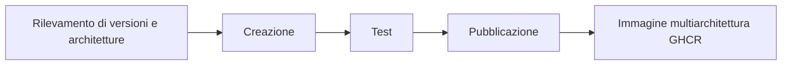

<div align="center">

**🌐 Lingue**

[Türkçe](../../README.md) · [English](README.en.md) · [简体中文](README.zh-CN.md) · [繁體中文](README.zh-TW.md) · [日本語](README.ja.md) · [한국어](README.ko.md)

[Deutsch](README.de.md) · [Français](README.fr.md) · [Español](README.es.md) · [Português (Brasil)](README.pt-BR.md) · **Italiano** · [Русский](README.ru.md)

[Українська](README.uk.md) · [العربية](README.ar.md) · [فارسی](README.fa.md) · [हिन्दी](README.hi.md) · [Bahasa Indonesia](README.id.md) · [Tiếng Việt](README.vi.md)

</div>

---

# Low-Price-Hosting · Container

**Immagini base Linux per container — creazione dalle ricette sorgente, test per architettura e pubblicazione su GHCR.**

[](https://github.com/Low-Price-Hosting/Container/actions/workflows/build-base-images.yml)
[](https://github.com/Low-Price-Hosting/Cron/actions/workflows/mirror-container-sources.yml)
[](https://github.com/orgs/Low-Price-Hosting/packages?ecosystem=container)

**8 distribuzioni** · **Versioni e architetture dinamiche** · **Creazione → Test → Pubblicazione**

[Immagini](#images-and-downloads) · [Architetture](#versions-and-architectures) · [Utilizzo](#quick-start) · [Avviare le build](#run-builds) · [Flusso di creazione](#pipeline) · [Informazioni sulle immagini](#oci-metadata)

---

<a id="images-and-downloads"></a>

## Immagini e download

| Distribuzione | Riferimento dell’immagine | Tag e OS/Arch | Download totali |
|---|---|---|---|
| [Ubuntu](https://github.com/Low-Price-Hosting/Ubuntu) | `ghcr.io/low-price-hosting/ubuntu` | [Pacchetti](https://github.com/orgs/Low-Price-Hosting/packages/container/package/ubuntu) | [](https://github.com/orgs/Low-Price-Hosting/packages/container/package/ubuntu) |
| [Debian](https://github.com/Low-Price-Hosting/Debian) | `ghcr.io/low-price-hosting/debian` | [Pacchetti](https://github.com/orgs/Low-Price-Hosting/packages/container/package/debian) | [](https://github.com/orgs/Low-Price-Hosting/packages/container/package/debian) |
| [CentOS Stream](https://github.com/Low-Price-Hosting/Centos) | `ghcr.io/low-price-hosting/centos` | [Pacchetti](https://github.com/orgs/Low-Price-Hosting/packages/container/package/centos) | [](https://github.com/orgs/Low-Price-Hosting/packages/container/package/centos) |
| [Alpine](https://github.com/Low-Price-Hosting/Alpine) | `ghcr.io/low-price-hosting/alpine` | [Pacchetti](https://github.com/orgs/Low-Price-Hosting/packages/container/package/alpine) | [](https://github.com/orgs/Low-Price-Hosting/packages/container/package/alpine) |
| [Fedora](https://github.com/Low-Price-Hosting/Fedora) | `ghcr.io/low-price-hosting/fedora` | [Pacchetti](https://github.com/orgs/Low-Price-Hosting/packages/container/package/fedora) | [](https://github.com/orgs/Low-Price-Hosting/packages/container/package/fedora) |
| [AlmaLinux](https://github.com/Low-Price-Hosting/AlmaLinux) | `ghcr.io/low-price-hosting/almalinux` | [Pacchetti](https://github.com/orgs/Low-Price-Hosting/packages/container/package/almalinux) | [](https://github.com/orgs/Low-Price-Hosting/packages/container/package/almalinux) |
| [Arch Linux](https://github.com/Low-Price-Hosting/ArchLinux) | `ghcr.io/low-price-hosting/archlinux` | [Pacchetti](https://github.com/orgs/Low-Price-Hosting/packages/container/package/archlinux) | [](https://github.com/orgs/Low-Price-Hosting/packages/container/package/archlinux) |
| [Rocky Linux](https://github.com/Low-Price-Hosting/RockyLinux) | `ghcr.io/low-price-hosting/rockylinux` | [Pacchetti](https://github.com/orgs/Low-Price-Hosting/packages/container/package/rockylinux) | [](https://github.com/orgs/Low-Price-Hosting/packages/container/package/rockylinux) |

I badge di download mostrano il valore **Download totali** di GitHub Packages. I download per versione e le architetture pubblicate sono disponibili nella pagina del pacchetto corrispondente. La cache può ritardare l’aggiornamento dei contatori; un contatore illeggibile non significa **0**.

<a id="versions-and-architectures"></a>

## Riferimenti di versioni e architetture

Riferimenti di versioni e architetture dal [piano di rilevamento dell’8 ottobre 2026](https://github.com/Low-Price-Hosting/Container/actions/runs/37741062225). Sono le destinazioni rilevate; verificare le architetture pubblicate nel campo **OS/Arch** del tag scelto o nel suo indice OCI.

| Distribuzione | Versioni | Piattaforme — con il prefisso `linux/` |
|---|---|---|
| Ubuntu | `22.04`, `24.04`, `26.04` | `amd64`, `arm/v7`, `arm64`, `ppc64le`, `riscv64`, `s390x` |
| Debian | `bookworm` | `386`, `amd64`, `arm/v7`, `arm64`, `ppc64le` |
| Debian | `trixie` | `386`, `amd64`, `arm/v5`, `arm/v7`, `arm64`, `ppc64le`, `riscv64`, `s390x` |
| CentOS Stream | `stream9`, `stream10` | `amd64`, `arm64`, `ppc64le`, `s390x` |
| Alpine | `3.21`, `3.22`, `3.23`, `3.24` | `386`, `amd64`, `arm/v6`, `arm/v7`, `arm64`, `ppc64le`, `riscv64`, `s390x` |
| Fedora | `43`, `44` | `amd64`, `arm64`, `ppc64le`, `s390x` |
| AlmaLinux | `8`, `9` | `386`, `amd64`, `arm64`, `ppc64le`, `s390x` |
| AlmaLinux | `10` | `386`, `amd64`, `amd64/v2`, `arm64`, `ppc64le`, `s390x` |
| Arch Linux | `rolling` | `amd64` |
| Rocky Linux | `8` | `amd64`, `arm64` |
| Rocky Linux | `9` | `amd64`, `arm64`, `ppc64le`, `s390x` |
| Rocky Linux | `10` | `amd64`, `arm64`, `ppc64le`, `riscv64`*, `s390x` |

\* La destinazione `riscv64` di Rocky Linux 10 è stata esclusa dalla creazione in questo piano. Le architetture disponibili possono variare in base alla versione.

Esaminare le architetture effettive di un tag:

```bash
docker buildx imagetools inspect ghcr.io/low-price-hosting/ubuntu:24.04
docker buildx imagetools inspect --raw ghcr.io/low-price-hosting/ubuntu:24.04
```

<a id="quick-start"></a>

## Utilizzo rapido

Sostituire `24.04` negli esempi con il **tag pubblicato** che si desidera usare. Non è necessario accedere a GHCR per scaricare immagini pubbliche.

### Scaricare ed eseguire

```bash
docker pull ghcr.io/low-price-hosting/ubuntu:24.04
docker run --rm -it ghcr.io/low-price-hosting/ubuntu:24.04 /bin/sh
```

Docker seleziona dal tag multiarchitettura l’immagine adatta all’architettura del computer.

### Scegliere un’architettura

```bash
docker pull --platform linux/arm64 ghcr.io/low-price-hosting/ubuntu:24.04

docker run --rm --platform linux/arm64 \
  ghcr.io/low-price-hosting/ubuntu:24.04 \
  /bin/sh -c 'cat /etc/os-release'
```

Per eseguire un’immagine di un’altra famiglia di processori è necessaria un’emulazione adeguata.

### Fissare tramite digest

```bash
docker image inspect --format '{{json .RepoDigests}}' \
  ghcr.io/low-price-hosting/ubuntu:24.04

# Sostituire <digest> con il valore SHA256 dell’immagine.
docker pull ghcr.io/low-price-hosting/ubuntu@sha256:<digest>
```

I tag di versione possono essere aggiornati; il digest permette di riutilizzare la stessa immagine.

### Usare nella propria immagine

```dockerfile
FROM ghcr.io/low-price-hosting/ubuntu:24.04

COPY app/ /opt/app/
WORKDIR /opt/app
CMD ["/bin/sh"]
```

<a id="run-builds"></a>

## Avviare le build

[Actions → Creare immagini base → Eseguire il flusso di lavoro](https://github.com/Low-Price-Hosting/Container/actions/workflows/build-base-images.yml):

| Campo | Utilizzo |
|---|---|
| `distribution` | `all` o il nome di una distribuzione. |
| `version` | `all` o una versione esatta, come `24.04`, `trixie`, `stream10` o `rolling`. |
| `verify_only` | `true`: ricreare/testare senza pubblicare. `false`: creare/testare e pubblicare le immagini modificate o mancanti. |

Vengono elaborate tutte le architetture rilevate per la versione selezionata. Con GitHub CLI:

```bash
# Creare e pubblicare le immagini modificate o mancanti di tutte le distribuzioni.
gh workflow run build-base-images.yml \
  --repo Low-Price-Hosting/Container --ref main \
  -f distribution=all -f version=all -f verify_only=false

# Creare e testare soltanto le immagini Fedora.
gh workflow run build-base-images.yml \
  --repo Low-Price-Hosting/Container --ref main \
  -f distribution=Fedora -f version=all -f verify_only=true
```

Il badge di creazione in alto mostra il risultato dell’ultimo flusso di lavoro; un’esecuzione di sola verifica non pubblica immagini.

<a id="pipeline"></a>

## Flusso di creazione



| Fase | Operazione eseguita sull’immagine |
|---|---|
| **Creazione** | Il rootfs/l’immagine viene creato con la ricetta di creazione dei container della distribuzione. |
| **Test** | L’immagine viene eseguita su un runner separato; vengono controllati l’identità della distribuzione, il gestore di pacchetti, l’architettura e l’etichetta di origine. |
| **Pubblicazione** | Il tag di versione multiarchitettura viene pubblicato quando tutte le architetture previste per quella versione superano i test. |

Ogni destinazione di creazione/test usa un runner separato. I test verificano il funzionamento di base; non sono test completi di compatibilità delle applicazioni.

Le nuove versioni e architetture vengono rilevate automaticamente dai cataloghi sorgente. Vengono inserite nel piano di creazione quando sono pronti la ricetta corrispondente, il branch sorgente, il manifesto di bootstrap e i repository dei pacchetti. Le sorgenti vengono aggiornate dal flusso Cron ogni ora; la pianificazione di GitHub può subire ritardi.

<a id="oci-metadata"></a>

## Tag e informazioni sulle immagini

| Riferimento | Significato |
|---|---|
| `ubuntu:24.04`, `debian:trixie`, `centos:stream10` | Tag multiarchitettura che contiene le architetture testate della versione corrispondente. |
| `latest` e altri alias | Tag determinati dal catalogo delle versioni della distribuzione. |
| `<image>@sha256:<digest>` | Riferimento immutabile al contenuto dell’immagine. |

Le informazioni su origine, versione e creazione dell’immagine sono disponibili nei metadati OCI:

```bash
docker image inspect --format '{{json .Config.Labels}}' \
  ghcr.io/low-price-hosting/ubuntu:24.04
```

`org.opencontainers.image.source` indica il repository della ricetta sorgente, `org.opencontainers.image.version` la versione e `io.low-price-hosting.build.source` il codice di creazione. L’indice multiarchitettura e le annotazioni delle architetture possono essere letti con `docker buildx imagetools inspect --raw`.
