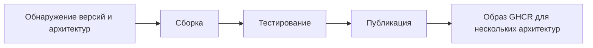

<div align="center">

**🌐 Языки**

[Türkçe](../../README.md) · [English](README.en.md) · [简体中文](README.zh-CN.md) · [繁體中文](README.zh-TW.md) · [日本語](README.ja.md) · [한국어](README.ko.md)

[Deutsch](README.de.md) · [Français](README.fr.md) · [Español](README.es.md) · [Português (Brasil)](README.pt-BR.md) · [Italiano](README.it.md) · **Русский**

[Українська](README.uk.md) · [العربية](README.ar.md) · [فارسی](README.fa.md) · [हिन्दी](README.hi.md) · [Bahasa Indonesia](README.id.md) · [Tiếng Việt](README.vi.md)

</div>

---

# Low-Price-Hosting · Container

**Базовые контейнерные образы Linux — сборка по исходным рецептам, тестирование каждой архитектуры и публикация в GHCR.**

[](https://github.com/Low-Price-Hosting/Container/actions/workflows/build-base-images.yml)
[](https://github.com/Low-Price-Hosting/Cron/actions/workflows/mirror-container-sources.yml)
[](https://github.com/orgs/Low-Price-Hosting/packages?ecosystem=container)

**8 дистрибутивов** · **Динамические версии и архитектуры** · **Сборка → Тестирование → Публикация**

[Образы](#images-and-downloads) · [Архитектуры](#versions-and-architectures) · [Использование](#quick-start) · [Запуск сборки](#run-builds) · [Процесс сборки](#pipeline) · [Сведения об образах](#oci-metadata)

---

<a id="images-and-downloads"></a>

## Образы и загрузки

| Дистрибутив | Ссылка на образ | Теги и OS/Arch | Всего загрузок |
|---|---|---|---|
| [Ubuntu](https://github.com/Low-Price-Hosting/Ubuntu) | `ghcr.io/low-price-hosting/ubuntu` | [Пакеты](https://github.com/orgs/Low-Price-Hosting/packages/container/package/ubuntu) | [](https://github.com/orgs/Low-Price-Hosting/packages/container/package/ubuntu) |
| [Debian](https://github.com/Low-Price-Hosting/Debian) | `ghcr.io/low-price-hosting/debian` | [Пакеты](https://github.com/orgs/Low-Price-Hosting/packages/container/package/debian) | [](https://github.com/orgs/Low-Price-Hosting/packages/container/package/debian) |
| [CentOS Stream](https://github.com/Low-Price-Hosting/Centos) | `ghcr.io/low-price-hosting/centos` | [Пакеты](https://github.com/orgs/Low-Price-Hosting/packages/container/package/centos) | [](https://github.com/orgs/Low-Price-Hosting/packages/container/package/centos) |
| [Alpine](https://github.com/Low-Price-Hosting/Alpine) | `ghcr.io/low-price-hosting/alpine` | [Пакеты](https://github.com/orgs/Low-Price-Hosting/packages/container/package/alpine) | [](https://github.com/orgs/Low-Price-Hosting/packages/container/package/alpine) |
| [Fedora](https://github.com/Low-Price-Hosting/Fedora) | `ghcr.io/low-price-hosting/fedora` | [Пакеты](https://github.com/orgs/Low-Price-Hosting/packages/container/package/fedora) | [](https://github.com/orgs/Low-Price-Hosting/packages/container/package/fedora) |
| [AlmaLinux](https://github.com/Low-Price-Hosting/AlmaLinux) | `ghcr.io/low-price-hosting/almalinux` | [Пакеты](https://github.com/orgs/Low-Price-Hosting/packages/container/package/almalinux) | [](https://github.com/orgs/Low-Price-Hosting/packages/container/package/almalinux) |
| [Arch Linux](https://github.com/Low-Price-Hosting/ArchLinux) | `ghcr.io/low-price-hosting/archlinux` | [Пакеты](https://github.com/orgs/Low-Price-Hosting/packages/container/package/archlinux) | [](https://github.com/orgs/Low-Price-Hosting/packages/container/package/archlinux) |
| [Rocky Linux](https://github.com/Low-Price-Hosting/RockyLinux) | `ghcr.io/low-price-hosting/rockylinux` | [Пакеты](https://github.com/orgs/Low-Price-Hosting/packages/container/package/rockylinux) | [](https://github.com/orgs/Low-Price-Hosting/packages/container/package/rockylinux) |

Значки загрузок показывают значение **Всего загрузок** в GitHub Packages. Загрузки по версиям и опубликованные архитектуры указаны на странице соответствующего пакета. Из-за кеширования счётчики могут обновляться с задержкой; недоступный счётчик не означает **0**.

<a id="versions-and-architectures"></a>

## Справочные версии и архитектуры

Справочные версии и архитектуры из [плана обнаружения от 8 октября 2026 года](https://github.com/Low-Price-Hosting/Container/actions/runs/37741062225). Это обнаруженные цели; проверяйте опубликованные архитектуры в поле **OS/Arch** выбранного тега или в индексе OCI.

| Дистрибутив | Версии | Платформы — с префиксом `linux/` |
|---|---|---|
| Ubuntu | `22.04`, `24.04`, `26.04` | `amd64`, `arm/v7`, `arm64`, `ppc64le`, `riscv64`, `s390x` |
| Debian | `bookworm` | `386`, `amd64`, `arm/v7`, `arm64`, `ppc64le` |
| Debian | `trixie` | `386`, `amd64`, `arm/v5`, `arm/v7`, `arm64`, `ppc64le`, `riscv64`, `s390x` |
| CentOS Stream | `stream9`, `stream10` | `amd64`, `arm64`, `ppc64le`, `s390x` |
| Alpine | `3.21`, `3.22`, `3.23`, `3.24` | `386`, `amd64`, `arm/v6`, `arm/v7`, `arm64`, `ppc64le`, `riscv64`, `s390x` |
| Fedora | `43`, `44` | `amd64`, `arm64`, `ppc64le`, `s390x` |
| AlmaLinux | `8`, `9` | `386`, `amd64`, `arm64`, `ppc64le`, `s390x` |
| AlmaLinux | `10` | `386`, `amd64`, `amd64/v2`, `arm64`, `ppc64le`, `s390x` |
| Arch Linux | `rolling` | `amd64` |
| Rocky Linux | `8` | `amd64`, `arm64` |
| Rocky Linux | `9` | `amd64`, `arm64`, `ppc64le`, `s390x` |
| Rocky Linux | `10` | `amd64`, `arm64`, `ppc64le`, `riscv64`*, `s390x` |

\* Цель Rocky Linux 10 `riscv64` была исключена из сборки в этом плане. Наборы архитектур могут различаться в зависимости от версии.

Просмотрите фактические архитектуры тега:

```bash
docker buildx imagetools inspect ghcr.io/low-price-hosting/ubuntu:24.04
docker buildx imagetools inspect --raw ghcr.io/low-price-hosting/ubuntu:24.04
```

<a id="quick-start"></a>

## Быстрое начало

Вместо `24.04` в примерах выберите **опубликованный тег**, который хотите использовать. Для загрузки общедоступных образов вход в GHCR не требуется.

### Загрузить и запустить

```bash
docker pull ghcr.io/low-price-hosting/ubuntu:24.04
docker run --rm -it ghcr.io/low-price-hosting/ubuntu:24.04 /bin/sh
```

Docker выбирает из тега для нескольких архитектур образ, соответствующий архитектуре вашего компьютера.

### Выбрать архитектуру

```bash
docker pull --platform linux/arm64 ghcr.io/low-price-hosting/ubuntu:24.04

docker run --rm --platform linux/arm64 \
  ghcr.io/low-price-hosting/ubuntu:24.04 \
  /bin/sh -c 'cat /etc/os-release'
```

Для запуска образа другой процессорной архитектуры требуется соответствующая эмуляция.

### Закрепить по дайджесту

```bash
docker image inspect --format '{{json .RepoDigests}}' \
  ghcr.io/low-price-hosting/ubuntu:24.04

# Замените <digest> значением SHA256 образа.
docker pull ghcr.io/low-price-hosting/ubuntu@sha256:<digest>
```

Теги версий могут обновляться; дайджест позволяет повторно использовать тот же образ.

### Использовать в собственном образе

```dockerfile
FROM ghcr.io/low-price-hosting/ubuntu:24.04

COPY app/ /opt/app/
WORKDIR /opt/app
CMD ["/bin/sh"]
```

<a id="run-builds"></a>

## Запуск сборки

[Действия → Сборка базовых образов → Запустить рабочий процесс](https://github.com/Low-Price-Hosting/Container/actions/workflows/build-base-images.yml):

| Поле | Использование |
|---|---|
| `distribution` | `all` или название дистрибутива. |
| `version` | `all` или точная версия, например `24.04`, `trixie`, `stream10`, `rolling`. |
| `verify_only` | `true`: повторная сборка и тестирование без публикации. `false`: сборка, тестирование и публикация изменённых или отсутствующих образов. |

Обрабатываются все обнаруженные архитектуры выбранной версии. Через GitHub CLI:

```bash
# Собрать и опубликовать изменённые или отсутствующие образы всех дистрибутивов.
gh workflow run build-base-images.yml \
  --repo Low-Price-Hosting/Container --ref main \
  -f distribution=all -f version=all -f verify_only=false

# Только собрать и протестировать образы Fedora.
gh workflow run build-base-images.yml \
  --repo Low-Price-Hosting/Container --ref main \
  -f distribution=Fedora -f version=all -f verify_only=true
```

Значок сборки вверху показывает результат последнего рабочего процесса; запуск только для проверки не публикует образы.

<a id="pipeline"></a>

## Процесс сборки



| Этап | Действия с образом |
|---|---|
| **Сборка** | Корневая файловая система/образ создаётся по рецепту сборки контейнера дистрибутива. |
| **Тестирование** | Образ запускается на отдельном исполнителе; проверяются идентификатор дистрибутива, менеджер пакетов, архитектура и метка источника. |
| **Публикация** | Когда все ожидаемые архитектуры версии проходят тестирование, публикуется тег версии для нескольких архитектур. |

Каждая цель сборки и тестирования использует отдельный исполнитель. Тесты проверяют базовую работоспособность; это не всестороннее тестирование совместимости приложений.

Новые версии и архитектуры автоматически обнаруживаются в каталогах источников. Они включаются в план сборки, когда готовы соответствующий рецепт, исходная ветка, манифест начальной загрузки и репозитории пакетов. Источники обновляются ежечасным рабочим процессом Cron; расписание GitHub может выполняться с задержкой.

<a id="oci-metadata"></a>

## Теги и сведения об образах

| Ссылка | Значение |
|---|---|
| `ubuntu:24.04`, `debian:trixie`, `centos:stream10` | Тег для нескольких архитектур, содержащий протестированные архитектуры соответствующей версии. |
| `latest` и другие псевдонимы | Теги, определяемые каталогом версий дистрибутива. |
| `<image>@sha256:<digest>` | Неизменяемая ссылка на содержимое образа. |

Сведения об источнике, версии и сборке образа находятся в метаданных OCI:

```bash
docker image inspect --format '{{json .Config.Labels}}' \
  ghcr.io/low-price-hosting/ubuntu:24.04
```

`org.opencontainers.image.source` указывает репозиторий исходного рецепта, `org.opencontainers.image.version` — версию, а `io.low-price-hosting.build.source` — код сборки. Индекс для нескольких архитектур и аннотации архитектур можно прочитать командой `docker buildx imagetools inspect --raw`.
