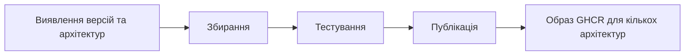

<div align="center">

**🌐 Мови**

[Türkçe](../../README.md) · [English](README.en.md) · [简体中文](README.zh-CN.md) · [繁體中文](README.zh-TW.md) · [日本語](README.ja.md) · [한국어](README.ko.md)

[Deutsch](README.de.md) · [Français](README.fr.md) · [Español](README.es.md) · [Português (Brasil)](README.pt-BR.md) · [Italiano](README.it.md) · [Русский](README.ru.md)

**Українська** · [العربية](README.ar.md) · [فارسی](README.fa.md) · [हिन्दी](README.hi.md) · [Bahasa Indonesia](README.id.md) · [Tiếng Việt](README.vi.md)

</div>

---

# Low-Price-Hosting · Container

**Базові контейнерні образи Linux — збирання за вихідними рецептами, тестування кожної архітектури та публікація в GHCR.**

[](https://github.com/Low-Price-Hosting/Container/actions/workflows/build-base-images.yml)
[](https://github.com/Low-Price-Hosting/Cron/actions/workflows/mirror-container-sources.yml)
[](https://github.com/orgs/Low-Price-Hosting/packages?ecosystem=container)

**8 дистрибутивів** · **Динамічні версії та архітектури** · **Збирання → Тестування → Публікація**

[Образи](#images-and-downloads) · [Архітектури](#versions-and-architectures) · [Використання](#quick-start) · [Запуск збирання](#run-builds) · [Процес збирання](#pipeline) · [Відомості про образи](#oci-metadata)

---

<a id="images-and-downloads"></a>

## Образи та завантаження

| Дистрибутив | Посилання на образ | Теги та OS/Arch | Усього завантажень |
|---|---|---|---|
| [Ubuntu](https://github.com/Low-Price-Hosting/Ubuntu) | `ghcr.io/low-price-hosting/ubuntu` | [Пакунки](https://github.com/orgs/Low-Price-Hosting/packages/container/package/ubuntu) | [](https://github.com/orgs/Low-Price-Hosting/packages/container/package/ubuntu) |
| [Debian](https://github.com/Low-Price-Hosting/Debian) | `ghcr.io/low-price-hosting/debian` | [Пакунки](https://github.com/orgs/Low-Price-Hosting/packages/container/package/debian) | [](https://github.com/orgs/Low-Price-Hosting/packages/container/package/debian) |
| [CentOS Stream](https://github.com/Low-Price-Hosting/Centos) | `ghcr.io/low-price-hosting/centos` | [Пакунки](https://github.com/orgs/Low-Price-Hosting/packages/container/package/centos) | [](https://github.com/orgs/Low-Price-Hosting/packages/container/package/centos) |
| [Alpine](https://github.com/Low-Price-Hosting/Alpine) | `ghcr.io/low-price-hosting/alpine` | [Пакунки](https://github.com/orgs/Low-Price-Hosting/packages/container/package/alpine) | [](https://github.com/orgs/Low-Price-Hosting/packages/container/package/alpine) |
| [Fedora](https://github.com/Low-Price-Hosting/Fedora) | `ghcr.io/low-price-hosting/fedora` | [Пакунки](https://github.com/orgs/Low-Price-Hosting/packages/container/package/fedora) | [](https://github.com/orgs/Low-Price-Hosting/packages/container/package/fedora) |
| [AlmaLinux](https://github.com/Low-Price-Hosting/AlmaLinux) | `ghcr.io/low-price-hosting/almalinux` | [Пакунки](https://github.com/orgs/Low-Price-Hosting/packages/container/package/almalinux) | [](https://github.com/orgs/Low-Price-Hosting/packages/container/package/almalinux) |
| [Arch Linux](https://github.com/Low-Price-Hosting/ArchLinux) | `ghcr.io/low-price-hosting/archlinux` | [Пакунки](https://github.com/orgs/Low-Price-Hosting/packages/container/package/archlinux) | [](https://github.com/orgs/Low-Price-Hosting/packages/container/package/archlinux) |
| [Rocky Linux](https://github.com/Low-Price-Hosting/RockyLinux) | `ghcr.io/low-price-hosting/rockylinux` | [Пакунки](https://github.com/orgs/Low-Price-Hosting/packages/container/package/rockylinux) | [](https://github.com/orgs/Low-Price-Hosting/packages/container/package/rockylinux) |

Значки завантажень показують значення **Усього завантажень** у GitHub Packages. Завантаження за версіями та опубліковані архітектури наведено на сторінці відповідного пакета. Через кешування лічильники можуть оновлюватися із затримкою; недоступний лічильник не означає **0**.

<a id="versions-and-architectures"></a>

## Довідкові версії та архітектури

Довідкові версії та архітектури з [плану виявлення від 8 жовтня 2026 року](https://github.com/Low-Price-Hosting/Container/actions/runs/37741062225). Це виявлені цілі; перевіряйте опубліковані архітектури в полі **OS/Arch** вибраного тега або в індексі OCI.

| Дистрибутив | Версії | Платформи — із префіксом `linux/` |
|---|---|---|
| Ubuntu | `22.04`, `24.04`, `26.04` | `amd64`, `arm/v7`, `arm64`, `ppc64le`, `riscv64`, `s390x` |
| Debian | `bookworm` | `386`, `amd64`, `arm/v7`, `arm64`, `ppc64le` |
| Debian | `trixie` | `386`, `amd64`, `arm/v5`, `arm/v7`, `arm64`, `ppc64le`, `riscv64`, `s390x` |
| CentOS Stream | `stream9`, `stream10` | `amd64`, `arm64`, `ppc64le`, `s390x` |
| Alpine | `3.21`, `3.22`, `3.23`, `3.24` | `386`, `amd64`, `arm/v6`, `arm/v7`, `arm64`, `ppc64le`, `riscv64`, `s390x` |
| Fedora | `43`, `44` | `amd64`, `arm64`, `ppc64le`, `s390x` |
| AlmaLinux | `8`, `9` | `386`, `amd64`, `arm64`, `ppc64le`, `s390x` |
| AlmaLinux | `10` | `386`, `amd64`, `amd64/v2`, `arm64`, `ppc64le`, `s390x` |
| Arch Linux | `rolling` | `amd64` |
| Rocky Linux | `8` | `amd64`, `arm64` |
| Rocky Linux | `9` | `amd64`, `arm64`, `ppc64le`, `s390x` |
| Rocky Linux | `10` | `amd64`, `arm64`, `ppc64le`, `riscv64`*, `s390x` |

\* Ціль Rocky Linux 10 `riscv64` було виключено зі збирання в цьому плані. Набори архітектур можуть відрізнятися залежно від версії.

Перегляньте фактичні архітектури тега:

```bash
docker buildx imagetools inspect ghcr.io/low-price-hosting/ubuntu:24.04
docker buildx imagetools inspect --raw ghcr.io/low-price-hosting/ubuntu:24.04
```

<a id="quick-start"></a>

## Швидкий початок

Замість `24.04` у прикладах виберіть **опублікований тег**, який хочете використовувати. Для завантаження загальнодоступних образів вхід у GHCR не потрібен.

### Завантажити та запустити

```bash
docker pull ghcr.io/low-price-hosting/ubuntu:24.04
docker run --rm -it ghcr.io/low-price-hosting/ubuntu:24.04 /bin/sh
```

Docker вибирає з тега для кількох архітектур образ, що відповідає архітектурі вашого комп’ютера.

### Вибрати архітектуру

```bash
docker pull --platform linux/arm64 ghcr.io/low-price-hosting/ubuntu:24.04

docker run --rm --platform linux/arm64 \
  ghcr.io/low-price-hosting/ubuntu:24.04 \
  /bin/sh -c 'cat /etc/os-release'
```

Для запуску образу іншої родини процесорів потрібна відповідна емуляція.

### Зафіксувати за дайджестом

```bash
docker image inspect --format '{{json .RepoDigests}}' \
  ghcr.io/low-price-hosting/ubuntu:24.04

# Замініть <digest> значенням SHA256 образу.
docker pull ghcr.io/low-price-hosting/ubuntu@sha256:<digest>
```

Теги версій можуть оновлюватися; дайджест дає змогу повторно використовувати той самий образ.

### Використати у власному образі

```dockerfile
FROM ghcr.io/low-price-hosting/ubuntu:24.04

COPY app/ /opt/app/
WORKDIR /opt/app
CMD ["/bin/sh"]
```

<a id="run-builds"></a>

## Запуск збирання

[Дії → Збирання базових образів → Запустити робочий процес](https://github.com/Low-Price-Hosting/Container/actions/workflows/build-base-images.yml):

| Поле | Використання |
|---|---|
| `distribution` | `all` або назва дистрибутива. |
| `version` | `all` або точна версія, наприклад `24.04`, `trixie`, `stream10`, `rolling`. |
| `verify_only` | `true`: повторне збирання й тестування без публікації. `false`: збирання, тестування та публікація змінених або відсутніх образів. |

Обробляються всі виявлені архітектури вибраної версії. Через GitHub CLI:

```bash
# Зібрати й опублікувати змінені або відсутні образи всіх дистрибутивів.
gh workflow run build-base-images.yml \
  --repo Low-Price-Hosting/Container --ref main \
  -f distribution=all -f version=all -f verify_only=false

# Лише зібрати й протестувати образи Fedora.
gh workflow run build-base-images.yml \
  --repo Low-Price-Hosting/Container --ref main \
  -f distribution=Fedora -f version=all -f verify_only=true
```

Значок збирання вгорі показує результат останнього робочого процесу; запуск лише для перевірки не публікує образи.

<a id="pipeline"></a>

## Процес збирання



| Етап | Дії з образом |
|---|---|
| **Збирання** | Коренева файлова система/образ створюється за рецептом збирання контейнера дистрибутива. |
| **Тестування** | Образ запускається на окремому виконавці; перевіряються ідентифікатор дистрибутива, менеджер пакунків, архітектура та мітка джерела. |
| **Публікація** | Коли всі очікувані архітектури версії проходять тестування, публікується тег версії для кількох архітектур. |

Кожна ціль збирання й тестування використовує окремого виконавця. Тести перевіряють базову працездатність; це не всебічне тестування сумісності застосунків.

Нові версії та архітектури автоматично виявляються в каталогах джерел. Їх включають до плану збирання, коли готові відповідний рецепт, вихідна гілка, маніфест початкового завантаження та репозиторії пакунків. Джерела оновлюються щогодинним робочим процесом Cron; виконання за розкладом GitHub може затримуватися.

<a id="oci-metadata"></a>

## Теги та відомості про образи

| Посилання | Значення |
|---|---|
| `ubuntu:24.04`, `debian:trixie`, `centos:stream10` | Тег для кількох архітектур, що містить протестовані архітектури відповідної версії. |
| `latest` та інші псевдоніми | Теги, визначені каталогом версій дистрибутива. |
| `<image>@sha256:<digest>` | Незмінне посилання на вміст образу. |

Відомості про джерело, версію та збирання образу містяться в метаданих OCI:

```bash
docker image inspect --format '{{json .Config.Labels}}' \
  ghcr.io/low-price-hosting/ubuntu:24.04
```

`org.opencontainers.image.source` указує репозиторій вихідного рецепта, `org.opencontainers.image.version` — версію, а `io.low-price-hosting.build.source` — код збирання. Індекс для кількох архітектур та анотації архітектур можна прочитати командою `docker buildx imagetools inspect --raw`.
