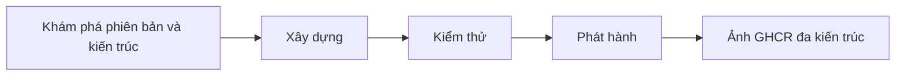

<div align="center">

**🌐 Ngôn ngữ**

[Türkçe](../../README.md) · [English](README.en.md) · [简体中文](README.zh-CN.md) · [繁體中文](README.zh-TW.md) · [日本語](README.ja.md) · [한국어](README.ko.md)

[Deutsch](README.de.md) · [Français](README.fr.md) · [Español](README.es.md) · [Português (Brasil)](README.pt-BR.md) · [Italiano](README.it.md) · [Русский](README.ru.md)

[Українська](README.uk.md) · [العربية](README.ar.md) · [فارسی](README.fa.md) · [हिन्दी](README.hi.md) · [Bahasa Indonesia](README.id.md) · **Tiếng Việt**

</div>

---

# Low-Price-Hosting · Container

**Ảnh container cơ sở Linux — xây dựng từ công thức nguồn, kiểm thử theo từng kiến trúc và phát hành lên GHCR.**

[](https://github.com/Low-Price-Hosting/Container/actions/workflows/build-base-images.yml)
[](https://github.com/Low-Price-Hosting/Cron/actions/workflows/mirror-container-sources.yml)
[](https://github.com/orgs/Low-Price-Hosting/packages?ecosystem=container)

**8 bản phân phối** · **Phiên bản và kiến trúc được xác định động** · **Xây dựng → Kiểm thử → Phát hành**

[Ảnh](#images-and-downloads) · [Kiến trúc](#versions-and-architectures) · [Sử dụng](#quick-start) · [Khởi chạy bản dựng](#run-builds) · [Quy trình xây dựng](#pipeline) · [Thông tin ảnh](#oci-metadata)

---

<a id="images-and-downloads"></a>

## Ảnh và lượt tải xuống

| Bản phân phối | Tham chiếu ảnh | Thẻ và OS/Arch | Tổng lượt tải xuống |
|---|---|---|---|
| [Ubuntu](https://github.com/Low-Price-Hosting/Ubuntu) | `ghcr.io/low-price-hosting/ubuntu` | [Các gói](https://github.com/orgs/Low-Price-Hosting/packages/container/package/ubuntu) | [](https://github.com/orgs/Low-Price-Hosting/packages/container/package/ubuntu) |
| [Debian](https://github.com/Low-Price-Hosting/Debian) | `ghcr.io/low-price-hosting/debian` | [Các gói](https://github.com/orgs/Low-Price-Hosting/packages/container/package/debian) | [](https://github.com/orgs/Low-Price-Hosting/packages/container/package/debian) |
| [CentOS Stream](https://github.com/Low-Price-Hosting/Centos) | `ghcr.io/low-price-hosting/centos` | [Các gói](https://github.com/orgs/Low-Price-Hosting/packages/container/package/centos) | [](https://github.com/orgs/Low-Price-Hosting/packages/container/package/centos) |
| [Alpine](https://github.com/Low-Price-Hosting/Alpine) | `ghcr.io/low-price-hosting/alpine` | [Các gói](https://github.com/orgs/Low-Price-Hosting/packages/container/package/alpine) | [](https://github.com/orgs/Low-Price-Hosting/packages/container/package/alpine) |
| [Fedora](https://github.com/Low-Price-Hosting/Fedora) | `ghcr.io/low-price-hosting/fedora` | [Các gói](https://github.com/orgs/Low-Price-Hosting/packages/container/package/fedora) | [](https://github.com/orgs/Low-Price-Hosting/packages/container/package/fedora) |
| [AlmaLinux](https://github.com/Low-Price-Hosting/AlmaLinux) | `ghcr.io/low-price-hosting/almalinux` | [Các gói](https://github.com/orgs/Low-Price-Hosting/packages/container/package/almalinux) | [](https://github.com/orgs/Low-Price-Hosting/packages/container/package/almalinux) |
| [Arch Linux](https://github.com/Low-Price-Hosting/ArchLinux) | `ghcr.io/low-price-hosting/archlinux` | [Các gói](https://github.com/orgs/Low-Price-Hosting/packages/container/package/archlinux) | [](https://github.com/orgs/Low-Price-Hosting/packages/container/package/archlinux) |
| [Rocky Linux](https://github.com/Low-Price-Hosting/RockyLinux) | `ghcr.io/low-price-hosting/rockylinux` | [Các gói](https://github.com/orgs/Low-Price-Hosting/packages/container/package/rockylinux) | [](https://github.com/orgs/Low-Price-Hosting/packages/container/package/rockylinux) |

Huy hiệu tải xuống hiển thị giá trị **Tổng lượt tải xuống** trên GitHub Packages. Lượt tải theo phiên bản và các kiến trúc đã phát hành nằm trên trang gói tương ứng. Bộ nhớ đệm có thể khiến bộ đếm cập nhật chậm; bộ đếm không đọc được không có nghĩa là **0**.

<a id="versions-and-architectures"></a>

## Tham chiếu phiên bản và kiến trúc

Tham chiếu phiên bản và kiến trúc từ [kế hoạch khám phá ngày 8 tháng 10 năm 2026](https://github.com/Low-Price-Hosting/Container/actions/runs/37741062225). Đây là các mục tiêu đã được phát hiện; hãy kiểm tra kiến trúc đã phát hành trong trường **OS/Arch** của thẻ bạn chọn hoặc trong chỉ mục OCI.

| Bản phân phối | Phiên bản | Nền tảng — với tiền tố `linux/` |
|---|---|---|
| Ubuntu | `22.04`, `24.04`, `26.04` | `amd64`, `arm/v7`, `arm64`, `ppc64le`, `riscv64`, `s390x` |
| Debian | `bookworm` | `386`, `amd64`, `arm/v7`, `arm64`, `ppc64le` |
| Debian | `trixie` | `386`, `amd64`, `arm/v5`, `arm/v7`, `arm64`, `ppc64le`, `riscv64`, `s390x` |
| CentOS Stream | `stream9`, `stream10` | `amd64`, `arm64`, `ppc64le`, `s390x` |
| Alpine | `3.21`, `3.22`, `3.23`, `3.24` | `386`, `amd64`, `arm/v6`, `arm/v7`, `arm64`, `ppc64le`, `riscv64`, `s390x` |
| Fedora | `43`, `44` | `amd64`, `arm64`, `ppc64le`, `s390x` |
| AlmaLinux | `8`, `9` | `386`, `amd64`, `arm64`, `ppc64le`, `s390x` |
| AlmaLinux | `10` | `386`, `amd64`, `amd64/v2`, `arm64`, `ppc64le`, `s390x` |
| Arch Linux | `rolling` | `amd64` |
| Rocky Linux | `8` | `amd64`, `arm64` |
| Rocky Linux | `9` | `amd64`, `arm64`, `ppc64le`, `s390x` |
| Rocky Linux | `10` | `amd64`, `arm64`, `ppc64le`, `riscv64`*, `s390x` |

\* Mục tiêu Rocky Linux 10 `riscv64` đã bị loại khỏi quá trình xây dựng trong kế hoạch này. Tập hợp kiến trúc có thể khác nhau tùy theo phiên bản.

Kiểm tra các kiến trúc thực tế của một thẻ:

```bash
docker buildx imagetools inspect ghcr.io/low-price-hosting/ubuntu:24.04
docker buildx imagetools inspect --raw ghcr.io/low-price-hosting/ubuntu:24.04
```

<a id="quick-start"></a>

## Sử dụng nhanh

Chọn **thẻ đã phát hành** mà bạn muốn sử dụng thay cho `24.04` trong các ví dụ. Không cần đăng nhập GHCR để tải xuống các ảnh công khai.

### Tải xuống và chạy

```bash
docker pull ghcr.io/low-price-hosting/ubuntu:24.04
docker run --rm -it ghcr.io/low-price-hosting/ubuntu:24.04 /bin/sh
```

Docker chọn từ thẻ đa kiến trúc ảnh phù hợp với kiến trúc của máy tính bạn.

### Chọn kiến trúc

```bash
docker pull --platform linux/arm64 ghcr.io/low-price-hosting/ubuntu:24.04

docker run --rm --platform linux/arm64 \
  ghcr.io/low-price-hosting/ubuntu:24.04 \
  /bin/sh -c 'cat /etc/os-release'
```

Để chạy ảnh thuộc một họ bộ xử lý khác, cần có trình giả lập phù hợp.

### Cố định bằng giá trị băm

```bash
docker image inspect --format '{{json .RepoDigests}}' \
  ghcr.io/low-price-hosting/ubuntu:24.04

# Thay <digest> bằng giá trị SHA256 của ảnh.
docker pull ghcr.io/low-price-hosting/ubuntu@sha256:<digest>
```

Thẻ phiên bản có thể được cập nhật; giá trị băm cho phép bạn sử dụng lại cùng một ảnh.

### Sử dụng trong ảnh của bạn

```dockerfile
FROM ghcr.io/low-price-hosting/ubuntu:24.04

COPY app/ /opt/app/
WORKDIR /opt/app
CMD ["/bin/sh"]
```

<a id="run-builds"></a>

## Khởi chạy bản dựng

[Hành động → Xây dựng ảnh cơ sở → Chạy quy trình công việc](https://github.com/Low-Price-Hosting/Container/actions/workflows/build-base-images.yml):

| Trường | Cách sử dụng |
|---|---|
| `distribution` | `all` hoặc tên một bản phân phối. |
| `version` | `all` hoặc phiên bản chính xác, chẳng hạn `24.04`, `trixie`, `stream10`, `rolling`. |
| `verify_only` | `true`: xây dựng và kiểm thử lại, không phát hành. `false`: xây dựng, kiểm thử và phát hành các ảnh đã thay đổi hoặc còn thiếu. |

Tất cả kiến trúc đã được phát hiện của phiên bản được chọn đều được xử lý. Qua GitHub CLI:

```bash
# Xây dựng và phát hành các ảnh đã thay đổi hoặc còn thiếu cho tất cả bản phân phối.
gh workflow run build-base-images.yml \
  --repo Low-Price-Hosting/Container --ref main \
  -f distribution=all -f version=all -f verify_only=false

# Chỉ xây dựng và kiểm thử các ảnh Fedora.
gh workflow run build-base-images.yml \
  --repo Low-Price-Hosting/Container --ref main \
  -f distribution=Fedora -f version=all -f verify_only=true
```

Huy hiệu xây dựng ở trên hiển thị kết quả của quy trình công việc gần nhất; một lần chạy chỉ để xác minh sẽ không phát hành ảnh.

<a id="pipeline"></a>

## Quy trình xây dựng



| Giai đoạn | Thao tác thực hiện với ảnh |
|---|---|
| **Xây dựng** | Tạo hệ thống tệp gốc/ảnh bằng công thức tạo container của bản phân phối. |
| **Kiểm thử** | Chạy ảnh trên một máy thực thi riêng; kiểm tra định danh bản phân phối, trình quản lý gói, kiến trúc và nhãn nguồn. |
| **Phát hành** | Phát hành thẻ phiên bản đa kiến trúc khi tất cả kiến trúc dự kiến của một phiên bản vượt qua kiểm thử. |

Mỗi mục tiêu xây dựng và kiểm thử sử dụng một máy thực thi riêng. Các bài kiểm thử chỉ kiểm tra hoạt động cơ bản; không phải kiểm thử toàn diện về khả năng tương thích của ứng dụng.

Các phiên bản và kiến trúc mới được phát hiện tự động từ danh mục nguồn. Chúng được đưa vào kế hoạch xây dựng khi công thức tương ứng, nhánh nguồn, bản kê khởi tạo và kho gói đã sẵn sàng. Các nguồn được cập nhật bằng quy trình Cron mỗi giờ; lịch chạy của GitHub có thể bị trễ.

<a id="oci-metadata"></a>

## Thẻ và thông tin ảnh

| Tham chiếu | Ý nghĩa |
|---|---|
| `ubuntu:24.04`, `debian:trixie`, `centos:stream10` | Thẻ đa kiến trúc chứa các kiến trúc đã được kiểm thử của phiên bản tương ứng. |
| `latest` và các bí danh khác | Các thẻ được xác định theo danh mục phiên bản của bản phân phối. |
| `<image>@sha256:<digest>` | Tham chiếu bất biến đến nội dung ảnh. |

Thông tin nguồn, phiên bản và quá trình xây dựng ảnh nằm trong siêu dữ liệu OCI:

```bash
docker image inspect --format '{{json .Config.Labels}}' \
  ghcr.io/low-price-hosting/ubuntu:24.04
```

`org.opencontainers.image.source` cho biết kho công thức nguồn, `org.opencontainers.image.version` cho biết phiên bản và `io.low-price-hosting.build.source` cho biết mã xây dựng. Có thể đọc chỉ mục đa kiến trúc và chú thích kiến trúc bằng `docker buildx imagetools inspect --raw`.
